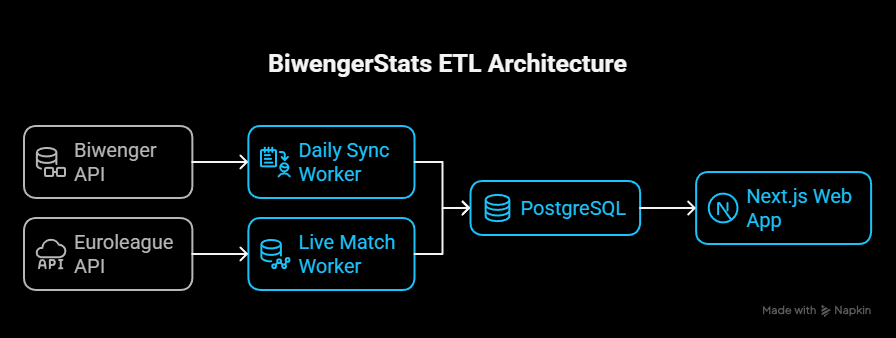

# Biwenger Stats - Euroleague Analytics

An advanced analytics dashboard for Euroleague fantasy managers on Biwenger. This application synchronizes data directly from Biwenger and provides insights, statistics, and tools to help you win your league.

## Features

- **Dashboard**: Overview of your team, market trends, and league standings
- **Player Analysis**: Detailed stats, hot/cold streaks, and form analysis
- **Market Intelligence**: Track price changes, undervalued players, and transfer history
- **League Stats**: Standings, round winners, and points progression charts
- **Tools**: Ideal lineup calculator and captain recommendations

## Tech Stack

| Category  | Technology              |
| --------- | ----------------------- |
| Framework | Next.js 16 (App Router) |
| Language  | JavaScript / Node.js    |
| Database  | PostgreSQL (via pg)     |
| Styling   | Tailwind CSS            |
| Charts    | Recharts                |
| Testing   | Vitest (79 tests)       |

## Architecture



## Quick Start

```bash
# 1. Clone and install
git clone https://github.com/yourusername/biwengerstats-next.git
cd biwengerstats-next
npm install

# 2. Configure environment
cp .env.example .env.local
# Edit .env.local with your Biwenger credentials

# 3. Sync data from Biwenger
npm run sync

# 4. Start development server
npm run dev
```

Open [http://localhost:3000](http://localhost:3000) in your browser.

## Available Scripts

| Script            | Description                 |
| ----------------- | --------------------------- |
| `npm run dev`     | Start development server    |
| `npm run build`   | Build for production        |
| `npm run start`   | Start production server     |
| `npm run sync`    | Sync data from Biwenger API |
| `npm test`        | Run test suite (79 tests)   |
| `npm run lint`    | Run ESLint                  |
| `npm run format`  | Format code with Prettier   |
| `npm run analyze` | Analyze bundle size         |

## Documentation

| Document                                        | Description                                     |
| ----------------------------------------------- | ----------------------------------------------- |
| [ARCHITECTURE.md](./docs/ARCHITECTURE.md)       | Technical overview, schema, APIs, and structure |
| [FEATURES.md](./docs/FEATURES.md)               | Catalog of all stats and features               |
| [DATA_SYNC.md](./docs/DATA_SYNC.md)             | Guide to data synchronization scripts           |
| [API_INTEGRATION.md](./docs/API_INTEGRATION.md) | Deep dive into API endpoints & extraction logic |
| [ROADMAP.md](./docs/ROADMAP.md)                 | Future features and improvements                |

## Project Structure

```
src/
├── app/                 # Next.js pages and API routes
│   ├── api/             # 32 API endpoints
│   ├── dashboard/       # Dashboard page
│   ├── standings/       # Standings page
│   └── player/[id]/     # Player profile page
├── components/          # React components
│   ├── dashboard/       # Dashboard cards
│   ├── standings/       # Standings cards
│   ├── players-list/    # Player list components
│   ├── player-profile/  # Player profile components
│   └── ui/              # Shared UI components
└── lib/                 # Utilities and database
    ├── db/              # Database layer
    │   ├── queries/     # Query functions
    │   └── types.js     # JSDoc type definitions
    ├── hooks/           # Custom React hooks
    ├── sync/            # Data sync scripts
    └── utils/           # Utilities (validation, response)
```

## Docker Support

The project runs on a full Docker stack: **App + PostgreSQL + Auto-Sync Worker**.

1. Create a `.env` file with your credentials:

   ```bash
   cp .env.example .env
   ```

2. Start the stack:

   ```bash
   docker-compose up -d
   ```

3. Access the application at [http://localhost:3000](http://localhost:3000).

The `sync` service runs automatically every 6 hours. You can restart it to force an update:

```bash
docker-compose restart sync
```

## Development

### Pre-commit Hooks

This project uses Husky + lint-staged for automatic code formatting:

```bash
git commit -m "Your message"
# Automatically runs Prettier and ESLint on staged files
```

### Testing

```bash
npm test           # Run all tests
npm test -- --ui   # Run with Vitest UI
```

### CI/CD

GitHub Actions runs on every push/PR:

- Lint check
- Test suite
- Build verification
- Format check

## Contributing

Contributions are welcome! Please:

1. Fork the repository
2. Create a feature branch
3. Make your changes
4. Run tests: `npm test`
5. Submit a pull request

## License

MIT
