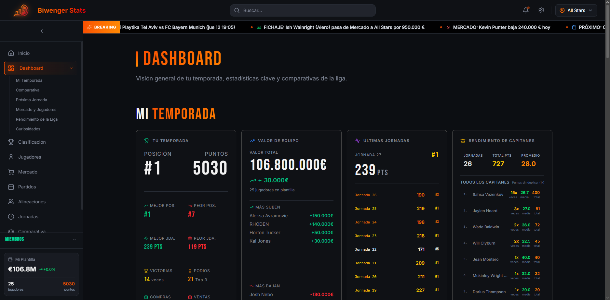

# 🏀 Biwenger Stats - Euroleague Analytics


> **Advanced financial analytics and performance tracking for Biwenger Euroleague fantasy managers.**

---

## 📸 Screeenshot


_(Please add a screenshot of your dashboard here)_

## 🚀 Overview

**Biwenger Stats** is a powerful companion app for fantasy basketball managers. It synchronizes data from Biwenger and Euroleague APIs to provide deep insights that the native platform misses. From identifying undervalued players ("Sniper Mode") to tracking your exact profit on every trade, this tool gives you the data-driven edge to win your league.

## ✨ Key Features

### 📊 Dashboard & Analytics

- **Live Scoring**: Real-time fantasy points updates during Euroleague games.
- **Squad Value Tracking**: Visualize your team's financial growth over the season.
- **Ideal Lineup**: Algorithm that calculates the maximum possible score for every round.

### 💰 Market Intelligence

- **Sniper Mode**: Identify undervalued players currently on the market.
- **Trade Analysis**: Track your best and worst transfers by profit margin.
- **Price Trends**: Interactive charts showing player value history (1W, 1M, Season).
- **Big Spender**: See who is investing the most cash in the market.

### 🏆 Tournaments

- **Custom Brackets**: Support for Cup/Playoff formats alongside the regular league.
- **Head-to-Head**: Direct comparison tools for player vs. player stats.

## 🛠️ Tech Stack

- **Framework**: Next.js 16 (App Router)
- **Database**: PostgreSQL (via `pg`)
- **Styling**: Tailwind CSS v4
- **Charts**: Recharts & Chart.js
- **Validation**: Zod
- **Testing**: Vitest

## 🏁 Getting Started

### Prerequisites

- Node.js 18+
- Docker & Docker Compose

### Installation

1.  **Clone the repository**

    ```bash
    git clone https://github.com/yourusername/biwengerstats-next.git
    cd biwengerstats-next
    ```

2.  **Configure Environment**

    ```bash
    cp .env.example .env
    # Add your BIWENGER_TOKEN and league credentials
    ```

3.  **Run with Docker**

    ```bash
    docker-compose up -d
    ```

4.  **Access the App**
    Open [http://localhost:3000](http://localhost:3000) in your browser.

## 🔄 Data Synchronization

The app uses a robust ETL pipeline to keep data fresh.

- **Full Sync**: `npm run sync` (Updates players, market, and stats)
- **Live Sync**: `npm run sync:live` (Fast updates for live games)
- **Daily Sync**: `npm run sync:daily` (Scheduled maintenance)

See [DATA_SYNC.md](./docs/DATA_SYNC.md) for details.

## 📚 Documentation

- [Features Guide](./docs/FEATURES.md)
- [Architecture Overview](./docs/ARCHITECTURE.md)
- [API Reference](./docs/API_INTEGRATION.md)

## 🤝 Contributing

Contributions are welcome! Please run the test suite before submitting a PR:

```bash
npm test
```

## 📄 License

This project is licensed under the MIT License - see the [LICENSE](LICENSE) file for details.
