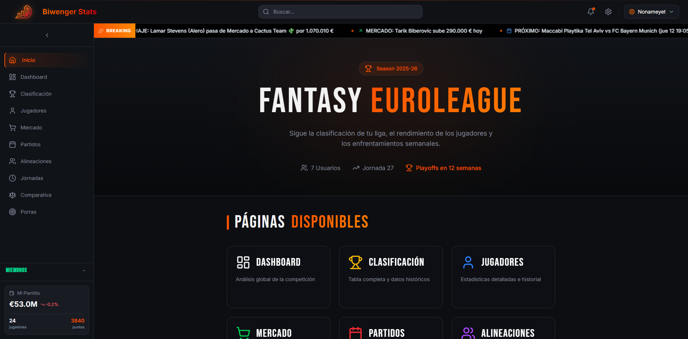

# 🏀 Biwenger Stats — Euroleague Analytics Platform


> **Advanced financial analytics and performance tracking for Biwenger Euroleague fantasy basketball managers.**

---

## 📸 Screenshots

<div align="center">
  
  
</div>

---

## 🚀 Overview

**Biwenger Stats** is a full-stack companion app for fantasy basketball managers competing in Biwenger's Euroleague format. It syncs live data from the Biwenger private API and the official Euroleague API through a custom ETL pipeline, storing it in PostgreSQL for deep analytical querying.

The platform provides insights unavailable in the native Biwenger app — from identifying undervalued market opportunities ("Sniper Mode") to tracking exact profit margins on every trade, calculating ideal lineups, and visualising squad growth over a season.

---

## ✨ Key Features

### 📊 Dashboard & Analytics

- **Live Scoring** — Real-time fantasy points updates during Euroleague games via a polling live-sync service
- **Ideal Lineup** — Algorithm that calculates maximum possible points for every past round (with ghost player handling)
- **Squad Value Tracking** — Visualise your team's financial growth over the season
- **Home vs Away Splits** — Performance breakdown by venue across the whole season
- **Captain Analysis** — Stats on captaincy choices and recommendations for upcoming rounds

### 💰 Market Intelligence

- **Sniper Mode** — Identify undervalued players currently listed on the market
- **Trade Analysis** — Track best/worst transfers by absolute profit and percentage return
- **Price Trends** — Interactive charts showing player value history (1W, 1M, 3M, 6M, 1Y)
- **Big Spender** — See who is investing the most across your league
- **Missed Opportunities** — Players you sold that went on to appreciate in value

### 🏆 Standings & Advanced Stats

- **Full Season Standings** — Sortable table with 10+ derived metrics per manager
- **All-Play-All** — Simulated standings if every manager played every other every week
- **Volatility Index** — Consistency vs variance analysis for each manager
- **Heat Check** — Streak detection (hot/cold streaks) across recent rounds
- **Dominance Score**, **Floor/Ceiling**, **Theoretical Gap**, **Rivalry Matrix**, and more

### 🔮 Predictions & Compare

- **Next-Round Predictability** — Which teams are easiest to predict based on historical scoring
- **Head-to-Head Compare** — Side-by-side breakdown of any two managers

---

## 🛠️ Tech Stack

See [`docs/TECH_STACK.md`](./docs/TECH_STACK.md) for the full deep-dive with rationale for every choice.

| Layer            | Technology                                               |
| ---------------- | -------------------------------------------------------- |
| **Framework**    | Next.js 16 (App Router, Server Components)               |
| **Language**     | TypeScript (API + services) · JavaScript (UI components) |
| **Database**     | PostgreSQL + Drizzle ORM                                 |
| **Auth**         | Auth.js v5 (next-auth) with `proxy.js` guard             |
| **Styling**      | Tailwind CSS v4 · clsx · tailwind-merge                  |
| **Animation**    | Framer Motion                                            |
| **Charts**       | Recharts · Chart.js                                      |
| **Validation**   | Zod · custom typed validators                            |
| **Testing**      | Vitest (66 tests, 7 suites)                              |
| **DevOps**       | Docker · GitHub Actions CI/CD                            |
| **Code Quality** | ESLint · Prettier · Husky · lint-staged                  |

---

## 🏁 Getting Started

### Prerequisites

- Node.js 18+
- Docker & Docker Compose (for the local database)

### Installation

1. **Clone the repository**

   ```bash
   git clone https://github.com/yourusername/biwengerstats-next.git
   cd biwengerstats-next
   ```

2. **Configure Environment**

   **🎯 Recommended: Use the Setup Wizard**

   ```bash
   npm run setup
   ```

   The wizard will:
   1. Ask you to paste your Biwenger token (from browser Developer Tools)
   2. Automatically fetch all your leagues and let you select one
   3. Extract your League ID and User ID automatically
   4. Prompt you to set an admin password
   5. Auto-generate a secure session encryption key
   6. Create your `.env` file with all required configuration

   <details>
   <summary><strong>Advanced: Manual Configuration</strong></summary>

   Copy the example environment file:

   ```bash
   cp .env.example .env
   ```

   Fill in the required variables. See `.env.example` for full documentation of each variable.

   </details>

3. **Start the database & app**

   ```bash
   docker-compose up -d
   npm run dev
   ```

4. **Run the initial data sync**

   ```bash
   npm run sync
   ```

5. **Open the app**

   Navigate to [http://localhost:3000](http://localhost:3000)

---

## 🔄 Data Synchronization

The app uses a staged ETL pipeline to keep data fresh from two external sources.

| Command              | Description                                 |
| -------------------- | ------------------------------------------- |
| `npm run sync`       | Full sync — players, market, stats, lineups |
| `npm run sync:daily` | Daily maintenance sync                      |
| `npm run sync:live`  | Fast polling sync during live games         |

See [`docs/DATA_SYNC.md`](./docs/DATA_SYNC.md) for the full pipeline documentation.

---

## 🧪 Testing

```bash
npm test          # Run all tests (watch mode)
npm test -- --run # Single run
```

66 tests across 7 suites covering API response structure, validation utilities, sync logic, and service integration.

---

## 📚 Documentation

| Document                                               | Description                                            |
| ------------------------------------------------------ | ------------------------------------------------------ |
| [`docs/TECH_STACK.md`](./docs/TECH_STACK.md)           | Deep-dive into every technology choice and why         |
| [`docs/ARCHITECTURE.md`](./docs/ARCHITECTURE.md)       | System architecture, data flow, and request lifecycle  |
| [`docs/PATTERNS.md`](./docs/PATTERNS.md)               | Design patterns and software engineering methodologies |
| [`docs/FEATURES.md`](./docs/FEATURES.md)               | Full feature catalogue                                 |
| [`docs/DATA_SYNC.md`](./docs/DATA_SYNC.md)             | ETL pipeline guide                                     |
| [`docs/API_INTEGRATION.md`](./docs/API_INTEGRATION.md) | External API integration reference                     |
| [`CONTRIBUTING.md`](./CONTRIBUTING.md)                 | Development workflow                                   |

---

## 📄 License

MIT — see [LICENSE](LICENSE)
