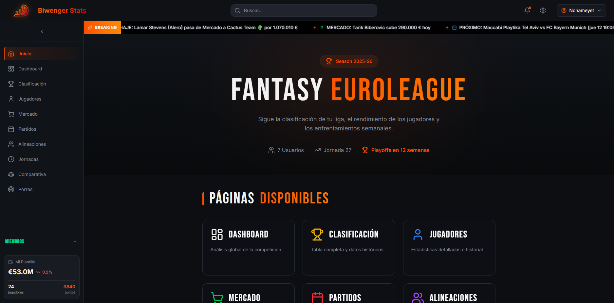
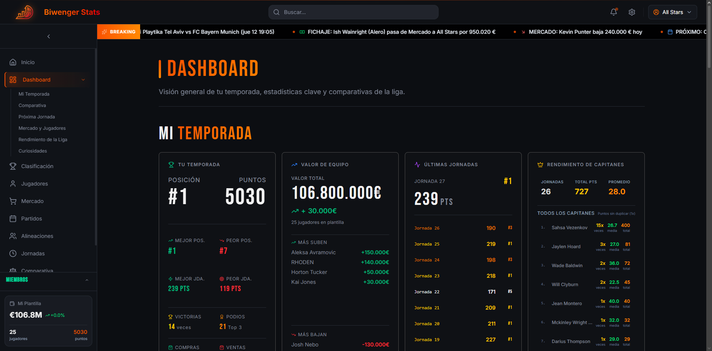

# 🏀 Biwenger Stats — Euroleague Analytics Platform

> **Advanced financial analytics and performance tracking for Biwenger Euroleague fantasy basketball managers.**

---

## 📸 Screenshots

  
  

---

## 🚀 Overview

**Biwenger Stats** is an AI-augmented analytics platform for fantasy basketball managers. It replaces standard spreadsheets with a premium, real-time dashboard that syncs data from the Biwenger and Euroleague APIs through a proprietary 15-step idempotent ETL pipeline.

The platform exposes insights unavailable elsewhere — from "La Enfermería" (detecting high-risk injuries) to "Bidding Duels" (tracking historical rivalries over market players).

---

## ✨ Key Features

### 💰 Market Intelligence (Elite Tier)

- **La Enfermería (The Infirmary)** — Identify expensive players with low availability to avoid market traps.
- **Bidding Duels & Matrix** — Track historical bidding wars between managers for the same players.
- **Sniper Mode** — Real-time detection of undervalued players currently listed on the market.
- **Market Trends** — Interactive charts for liquidity, global volume, and price evolution.
- **Big Spender Analysis** — Track investment trends across all managers in your league.

### 📊 Performance Analytics

- **All-Play-All Standings** — What if every manager played every other every week? Find the "unluckiest" manager.
- **Volatility & Heat Check** — Consistency analysis vs. scoring peaks to identify "hot" managers.
- **Theoretical Gap** — Measure the distance between active scores and "Ideal Lineup" possibilities.
- **Rivalry Matrix** — Detailed H2H breakdown across the entire season.

### 🛠️ Infrastructure & Data

- **Idempotent ETL** — 15 sequential sync steps ensure data integrity even after failure.
- **Live Scoring Pipeline** — High-frequency polling service for real-time fantasy points.
- **Interactive Setup Wizard** — Zero-config initialization via `npm run setup`.

---

## 🛠️ Tech Stack

| Layer          | Technology                                         |
| -------------- | -------------------------------------------------- |
| **Framework**  | **Next.js 16** (App Router, Turbopack)             |
| **Frontend**   | **React 19** · **Tailwind CSS v4** · Framer Motion |
| **Database**   | **PostgreSQL** + **Drizzle ORM** (Drizzle Kit)     |
| **Auth**       | **Auth.js v5** (beta) with custom `proxy.js` guard |
| **Testing**    | **Vitest** · Playwright                            |
| **Automation** | GitHub Actions CI/CD · Husky · lint-staged         |

---

## 🏁 Developer Experience

### Quick Start

1. **Clone & Install**: `git clone ... && npm install`
2. **Setup**: `npm run setup` (follow the interactive wizard for Biwenger tokens)
3. **Run**: `docker-compose up -d && npm run dev`
4. **Sync**: `npm run sync`

### Engineering Patterns

We follow a strict **4-Layer Architecture**:
`Query (Drizzle) → Service (Logic) → API Route (Handler) → UI Component (RSC/Client)`

Key patterns:

- **Registry / Strategy Pattern**: UI stat resolution is decoupled from component logic via `registry.js`.
- **Typed DAO**: All SQL queries are isolated in `src/lib/db/queries/` with Zod validation.

Refer to [**`.agents/INSTRUCTIONS.md`**](./.agents/INSTRUCTIONS.md) for detailed implementation patterns.

---

## 📚 Documentation & Legal

- **Technical Reference**: See [`docs/SYSTEM_GUIDE.md`](./docs/SYSTEM_GUIDE.md) for Architecture, Tech Stack, and Infrastructure.
- **Engineering Patterns**: See [`docs/PATTERNS.md`](./docs/PATTERNS.md) for software design and UI registries.
- **Feature Manual**: See [`docs/FEATURES.md`](./docs/FEATURES.md) for detailed analytical capabilities.
- **Contributing**: Contributions are welcome. Please open an issue first to discuss major changes.
- **Security**: Report vulnerabilities via private messaging. **Never commit your `.env` file.**
- **License**: MIT — see [LICENSE](LICENSE)
