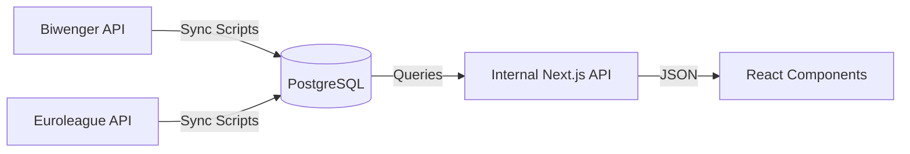

# Biwenger Stats - API Integration Reference

> **Technical Reference for Data Ingestion & Application APIs**
> This document details the external APIs consumed by the ETL pipeline and the internal APIs provided by the Next.js backend for the frontend.

## 🔄 Data Architecture

The application follows a **Local-First** architecture. The frontend **never** calls external APIs directly. All data is synchronized to a local PostgreSQL database via background jobs, and the frontend consumes this data via internal API routes.



---

## 1. External APIs (Ingestion Source)

These endpoints are used **only** by the synchronization scripts in `src/lib/sync/`.

### 1.1. Biwenger API

**Base URL**: `https://biwenger.as.com/api/v2`
**Auth**: `Authorization: Bearer <TOKEN>` + headers

| Resource         | Endpoint                        | Purpose                    | Sync Step       |
| ---------------- | ------------------------------- | -------------------------- | --------------- |
| **Master Data**  | `/competitions/euroleague/data` | Players, Teams, Prices     | `01-players.js` |
| **League Board** | `/league/{id}/board`            | Transfers, Market Listings | `07-market.js`  |
| **Round Stats**  | `/rounds/league?scoreID={id}`   | Player points per round    | `05-stats.js`   |
| **User Lineups** | `/user/{id}?fields=lineup`      | Active user formations     | `06-lineups.js` |
| **Standings**    | `/league/{id}?fields=standings` | League table               | `04-rounds.js`  |

#### 📄 Response Samples

<details>
<summary><strong>Master Data (Players & Teams)</strong></summary>

```json
{
  "data": {
    "players": {
      "41": {
        "id": 41,
        "name": "Niels Giffey",
        "slug": "giffey",
        "teamID": 572,
        "position": 2,
        "price": 150000,
        "fitness": [12, 12, 6, 7, -1],
        "points": 141
      }
    },
    "teams": {
      "560": {
        "id": 560,
        "name": "Anadolu Efes Istanbul",
        "slug": "anadolu-efes-istanbul",
        "nextGames": [
          {
            "id": 49953,
            "date": 1770917400,
            "home": { "id": 560 },
            "away": { "id": 645 }
          }
        ]
      }
    }
  }
}
```

</details>

<details>
<summary><strong>League Board (Market & Transfers)</strong></summary>

```json
{
  "data": [
    {
      "type": "transfer",
      "content": {
        "amount": 5000000,
        "player": { "id": 41, "name": "Niels Giffey" },
        "from": { "id": 123, "name": "User A" },
        "to": { "id": 456, "name": "User B" }
      },
      "date": 1770746411
    },
    {
      "type": "market",
      "content": {
        "player": { "id": 28228, "name": "Carsen Edwards" },
        "price": 4540000
      },
      "date": 1770740000
    }
  ]
}
```

</details>

<details>
<summary><strong>User Lineup</strong></summary>

```json
{
  "data": {
    "lineup": {
      "type": "3-1-1",
      "captain": { "id": 28228 },
      "players": [
        {
          "id": 27670,
          "name": "Aleksa Avramovic",
          "position": 1,
          "price": 3400000,
          "fitness": [27, 28, 14, 27, 11],
          "status": "ok"
        }
      ]
    }
  }
}
```

</details>

### 1.2. Euroleague API

**Base URL**: `https://live.euroleague.net/api`
**Auth**: Public

| Resource     | Endpoint                      | Purpose                        | Sync Step       |
| ------------ | ----------------------------- | ------------------------------ | --------------- |
| **Boxscore** | `/Header?gamecode={code}`     | Detailed stats (rebounds, etc) | `05-stats.js`   |
| **Schedule** | `/Schedules?seasoncode=E2025` | Season calendar                | `03-matches.js` |

#### 📄 Response Samples

<details>
<summary><strong>Boxscore (Player Stats)</strong></summary>

```json
{
  "Stats": [
    {
      "Team": "MAD",
      "PlayersStats": [
        {
          "Player": "Facundo Campazzo",
          "Player_ID": "P005517",
          "Minutes": "25:30",
          "Points": 15,
          "TotalRebounds": 2,
          "Assistances": 7,
          "Steals": 2,
          "Valuation": 20
        }
      ]
    }
  ]
}
```

</details>

---

## 2. Internal API (Application Backend)

These endpoints are provided by the `src/app/api` directory and are consumed by the frontend components.

**Base URL**: `/api`
**Response Format**:

```json
{
  "success": true,
  "data": { ... },
  "error": null // Only present on failure
}
```

### 2.1. Dashboard Endpoints

Located in `src/app/api/dashboard/`

| Endpoint                   | Method | Description               | Data Returned          |
| -------------------------- | ------ | ------------------------- | ---------------------- |
| `/dashboard/mvps`          | `GET`  | Last round's best players | Top 3 MVP cards        |
| `/dashboard/next-matches`  | `GET`  | Upcoming fixtures         | Grouped by day         |
| `/dashboard/ideal-lineup`  | `GET`  | Best possible team        | Players & total points |
| `/dashboard/rising-stars`  | `GET`  | Players improving form    | "Rising Stars" card    |
| `/dashboard/falling-stars` | `GET`  | Players losing form       | "Cold Streaks" card    |

### 2.2. Player & Market Analysis

Located in `src/app/api/player/` and `src/app/api/market/`

| Endpoint          | Method | Params               | Description                               |
| ----------------- | ------ | -------------------- | ----------------------------------------- |
| `/player/streaks` | `GET`  | -                    | Hot/Cold lists based on recent avg        |
| `/market/trends`  | `GET`  | `player_id`          | Price history graph data                  |
| `/market/snipers` | `GET`  | -                    | Undervalued players (High form/Low price) |
| `/stats/leaders`  | `GET`  | `type` (points, etc) | Statistical leaders board                 |

### 2.3. User & League Data

Located in `src/app/api/users/` and `src/app/api/standings/`

| Endpoint              | Method | Description                          |
| --------------------- | ------ | ------------------------------------ |
| `/users`              | `GET`  | List of all league members           |
| `/users/{id}/history` | `GET`  | User's performance history per round |
| `/standings`          | `GET`  | Current league table                 |
| `/compare/data`       | `GET`  | Head-to-head comparison data         |

### 2.4. Authentication

Located in `src/app/api/auth/`

| Endpoint        | Method | Description            |
| --------------- | ------ | ---------------------- |
| `/auth/login`   | `POST` | Admin login            |
| `/auth/session` | `GET`  | Verify current session |
| `/auth/logout`  | `POST` | Destroy session        |

---

## 3. Database Schema Mapping

Key tables populated by the sync process:

| Table                | Source                                     | Description                             |
| -------------------- | ------------------------------------------ | --------------------------------------- |
| `players`            | Biwenger Master Data                       | Static player info, team, current price |
| `player_round_stats` | Biwenger Round Stats + Euroleague Boxscore | Performance data per game               |
| `matches`            | Euroleague Schedule                        | Game dates, teams, results              |
| `market_entries`     | Biwenger Board                             | Daily market price snapshots            |
| `fichajes`           | Biwenger Board                             | Transfer history between users          |
| `users`              | Biwenger League                            | League participants info                |

For detailed schema, see `src/lib/db/schema.sql`.
