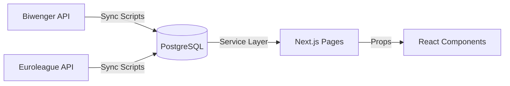
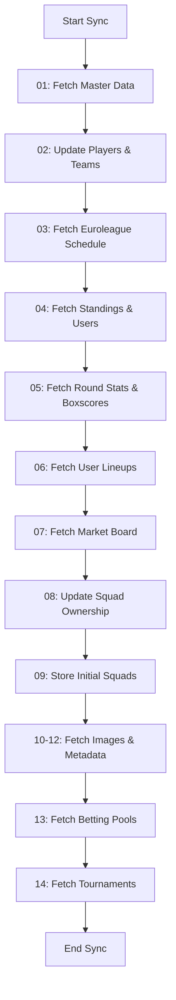

# Biwenger Stats - API Integration Reference

> **Complete External API Documentation**  
> This document details **all** external APIs consumed during data synchronization, including endpoints, response structures, and database transformations.

## 🔄 Data Architecture

The application follows a **Local-First** architecture:



**Key Principles:**

- Frontend **never** calls external APIs directly
- All data synced to local PostgreSQL via `src/lib/sync/`
- Pages fetch data via Service Layer (`src/lib/services/`)
- Internal HTTP APIs (`/api/*`) used only for client-side data fetching

---

## 1. External APIs (Data Ingestion)

### 1.1. Biwenger Core Data

#### Master Data (Players & Teams)

**Endpoint**: `GET /competitions/euroleague/data?lang=es`  
**Purpose**: Fetch all players, teams, and current round information  
**Sync Step**: `01-players.js`, `02-master-data.js`  
**Frequency**: Every sync (daily/manual)

<details>
<summary><strong>Response Sample</strong></summary>

```json
{
  "data": {
    "players": {
      "41": {
        "id": 41,
        "name": "Niels Giffey",
        "slug": "giffey",
        "teamID": 572,
        "position": 2,
        "price": 150000,
        "fantasyPrice": 15000000,
        "number": 5,
        "status": "ok",
        "priceIncrement": 0,
        "playedHome": 13,
        "playedAway": 10,
        "fitness": [12, 12, 6, 7, -1],
        "points": 141,
        "pointsHome": 89,
        "pointsAway": 52,
        "pointsLastSeason": 198
      }
    },
    "teams": {
      "560": {
        "id": 560,
        "name": "Anadolu Efes Istanbul",
        "slug": "anadolu-efes-istanbul",
        "nextGames": [
          {
            "id": 49953,
            "date": 1770917400,
            "round": { "id": 4773 },
            "home": { "id": 560, "score": null },
            "away": { "id": 645, "score": null }
          }
        ]
      }
    },
    "rounds": []
  }
}
```

</details>

**Database Transformation**:

- `players` → `players` table (id, name, team_id, position, price, status)
- `teams` → `teams` table (id, name, slug)
- `rounds` → Used for determining current/next round

---

#### Player Details (Individual Metadata)

**Endpoint**: `GET /players/euroleague/{id}?lang=es&fields=id,name,position,prices,birthday,height,weight,img`  
**Purpose**: Fetch detailed player metadata (height, weight, birthday, image)  
**Sync Step**: `01-players.js`  
**Frequency**: On-demand for missing player data

<details>
<summary><strong>Response Sample</strong></summary>

```json
{
  "status": 200,
  "data": {
    "id": 41,
    "name": "Niels Giffey",
    "slug": "giffey",
    "position": 2,
    "birthday": 19900620,
    "height": 201,
    "weight": 96,
    "img": "https://cdn.biwenger.com/players/euroleague/41.png",
    "prices": [{ "date": 1770304415, "price": 150000 }]
  }
}
```

</details>

**Database Transformation**:

- `birthday` → `players.birth_date` (converted to DATE)
- `height` → `players.height` (cm)
- `weight` → `players.weight` (kg)
- `img` → `players.img` (URL)

---

#### League Standings

**Endpoint**: `GET /league/{id}?fields=standings`  
**Purpose**: Current league table with user rankings  
**Sync Step**: `04-standings.js`  
**Frequency**: Every sync

<details>
<summary><strong>Response Sample</strong></summary>

```json
{
  "data": {
    "standings": [
      {
        "id": 13207868,
        "name": "All Stars",
        "icon": "icons/28.png",
        "points": 5030,
        "position": 1
      },
      {
        "id": 13207910,
        "name": "June",
        "icon": "icons/45.png",
        "points": 4890,
        "position": 2
      }
    ]
  }
}
```

</details>

**Database Transformation**:

- `standings` → `users` table (id, name, icon)
- `points` → Stored for historical tracking
- `position` → Current league rank

---

### 1.2. Biwenger Market & Transfers

#### League Board (Market Activity)

**Endpoint**: `GET /league/{id}/board?offset={offset}&limit={limit}`  
**Purpose**: Fetch market activity (transfers, predictions, bonuses, announcements)  
**Sync Step**: `07-market.js`, `13-porras.js`  
**Frequency**: Paginated fetch (50 items per page)

<details>
<summary><strong>Response Sample (Multiple Types)</strong></summary>

```json
{
  "data": [
    {
      "type": "bettingPool",
      "content": {
        "pool": {
          "id": 600885,
          "mode": "1x2",
          "games": [
            {
              "id": 49953,
              "home": { "name": "Anadolu Efes" },
              "away": { "name": "Virtus Bologna" }
            }
          ],
          "prizes": [0, 0, 5000, 20000],
          "responses": [
            {
              "id": 13207868,
              "name": "User A",
              "response": ["1", "X", "2"]
            }
          ]
        }
      },
      "date": 1770730000
    },
    {
      "type": "transfer",
      "content": [
        {
          "player": 41,
          "amount": 5000000,
          "from": { "id": 123, "name": "User A" },
          "to": { "id": 456, "name": "User B" },
          "bids": [{ "user": { "id": 789, "name": "User C" }, "amount": 4800000 }]
        }
      ],
      "date": 1770746411
    },
    {
      "type": "roundFinished",
      "content": {
        "round": { "id": 4773, "name": "Round 28" },
        "results": [
          {
            "user": { "id": 123, "name": "User A" },
            "points": 150,
            "bonus": 200000
          }
        ]
      },
      "date": 1770720000
    },
    {
      "type": "adminTransfer",
      "content": {
        "to": { "id": 456, "name": "User B" },
        "amount": 1000000,
        "text": "Corrective bonus"
      },
      "date": 1770710000
    }
  ]
}
```

</details>

**Database Transformation**:

- `type: "transfer"` → `fichajes` table (player_id, precio, vendedor, comprador, timestamp)
- `type: "transfer"` + `bids` → `bids` table (transfer_id, bidder_id, amount)
- `type: "bettingPool"` → `porras` table (user_id, round_id, result, aciertos)
- `type: "roundFinished"` + `bonus` → `finances` table (user_id, type: 'round_bonus', amount)
- `type: "adminTransfer"` → `finances` table (user_id, type: 'admin_bonus', amount)

---

#### User Squad (Ownership)

**Endpoint**: `GET /user/{id}?fields=players`  
**Purpose**: Fetch current player ownership for a user  
**Sync Step**: `08-squads.js`, `09-initial-squads.js`  
**Frequency**: Every sync for all users

<details>
<summary><strong>Response Sample</strong></summary>

```json
{
  "status": 200,
  "data": {
    "players": [
      {
        "id": 27670,
        "name": "Aleksa Avramovic",
        "position": 1,
        "price": 3400000,
        "team": { "id": 786, "name": "Dubai Basketball" }
      },
      {
        "id": 39172,
        "name": "Mckinley Wright IV",
        "position": 1,
        "price": 8910000,
        "team": { "id": 786, "name": "Dubai Basketball" }
      }
    ]
  }
}
```

</details>

**Database Transformation**:

- `players[].id` → Update `players.owner_id` to user ID
- First sync → Store in `initial_squads` table for historical reference

---

#### Round Standings & Lineups (Historical)

**Endpoint**: `GET /rounds/league/{roundId}`  
**Purpose**: Fetch user standings and lineups for a specific finished round  
**Sync Step**: `06-lineups.js`  
**Frequency**: For each finished round

<details>
<summary><strong>Response Sample</strong></summary>

```json
{
  "data": {
    "round": {
      "id": 4773,
      "name": "Round 28",
      "status": "finished",
      "standings": [
        {
          "id": 13207868,
          "name": "All Stars",
          "lineup": {
            "type": "3-1-1",
            "count": 1,
            "points": 150,
            "captain": { "id": 28228 },
            "players": [27670, 39172, 28228, 41, 52],
            "playersID": [27670, 39172, 28228, 41, 52]
          }
        },
        {
          "id": 13207910,
          "name": "June",
          "lineup": {
            "type": "3-1-1",
            "count": 1,
            "points": 142,
            "captain": { "id": 39172 },
            "players": [28228, 41, 52, 27670, 39172],
            "playersID": [28228, 41, 52, 27670, 39172]
          }
        }
      ]
    }
  }
}
```

</details>

**Database Transformation**:

- `standings[].lineup.players` → `user_lineups` table (user_id, round_id, player_id, role)
  - First 5 players → `role: 'titular'` (starters)
  - 6th player → `role: '6th_man'`
  - Remaining → `role: 'suplente'` (bench)
- `lineup.captain.id` → `user_lineups.is_captain = 1`
- `lineup.points` → `user_rounds.points` (total score for that round)
- `lineup.type` → `user_rounds.alineacion` (formation used)
- **Note**: This endpoint is called for **each finished round** to build historical lineup data

---

### 1.3. Biwenger Tournaments & Competitions

#### Home/Dashboard (Tournament Discovery)

**Endpoint**: `GET /home`  
**Purpose**: Discover active tournaments, events, and user fixtures  
**Sync Step**: `14-tournaments.js`  
**Frequency**: Every sync

<details>
<summary><strong>Response Sample</strong></summary>

```json
{
  "data": {
    "events": [
      {
        "type": "round",
        "round": { "id": 4773, "name": "Round 28" },
        "fixtures": [
          {
            "id": 123456,
            "tournament": { "id": 129035, "name": "Eliminatoria #2" },
            "home": { "id": 13207868, "name": "All Stars", "score": null },
            "away": { "id": 13207910, "name": "June", "score": null },
            "date": 1770917400,
            "status": "scheduled"
          }
        ]
      }
    ],
    "league": {
      "id": 2028379,
      "name": "My League",
      "board": [
        {
          "type": "tournament",
          "content": {
            "tournament": { "id": 129035, "name": "Eliminatoria #2" }
          }
        }
      ]
    }
  }
}
```

</details>

**Database Transformation**:

- Extract `tournament.id` from events/fixtures
- Used to trigger detailed tournament sync

---

#### Tournament Details (Phases, Fixtures, Standings)

**Endpoint**: `GET /tournaments/{id}`  
**Purpose**: Fetch complete tournament structure  
**Sync Step**: `14-tournaments.js`  
**Frequency**: For each discovered tournament

<details>
<summary><strong>Response Sample</strong></summary>

```json
{
  "data": {
    "id": 129035,
    "name": "Eliminatoria #2",
    "type": "knockout",
    "status": "active",
    "rounds": [
      {
        "index": 0,
        "type": "quarterfinals",
        "name": "Cuartos de Final",
        "round": { "id": 4773, "name": "Round 28" },
        "fixtures": [
          {
            "id": 123456,
            "home": { "id": 13207868, "name": "All Stars", "score": 150 },
            "away": { "id": 13207910, "name": "June", "score": 142 },
            "date": 1770917400,
            "status": "finished",
            "group": null
          }
        ]
      }
    ],
    "phases": {
      "knockout": {
        "name": "Eliminatorias",
        "groups": [
          {
            "name": null,
            "standings": [
              {
                "team": { "id": 13207868, "name": "All Stars" },
                "position": 1,
                "points": 3,
                "won": 1,
                "lost": 0,
                "scored": 150,
                "against": 142
              }
            ]
          }
        ]
      }
    }
  }
}
```

</details>

**Database Transformation**:

- `tournament` → `tournaments` table (id, name, type, status)
- `phases` → `tournament_phases` table (tournament_id, name, type, order_index)
- `rounds[].fixtures` → `tournament_fixtures` table (id, tournament_id, phase_id, home_user_id, away_user_id, home_score, away_score, status)
- `phases[].groups[].standings` → `tournament_standings` table (tournament_id, phase_name, user_id, position, points, won, lost)

---

### 1.4. Biwenger Match & Stats Data

---

#### Round Stats (Fantasy Points)

**Endpoint**: `GET /rounds/euroleague/{roundId}?score=1`  
**Purpose**: Fetch match results and player fantasy points (reports)  
**Sync Step**: `05-stats.js` (via `runBiwengerPoints`)  
**Frequency**: For each finished round

<details>
<summary><strong>Response Sample</strong></summary>

```json
{
  "data": {
    "games": [
      {
        "id": 49953,
        "date": 1770917400,
        "status": "finished",
        "home": {
          "id": 560,
          "name": "Anadolu Efes",
          "score": 85,
          "reports": {
            "41": {
              "points": 12,
              "player": { "id": 41, "name": "Niels Giffey" }
            }
          }
        },
        "away": {
          "id": 645,
          "name": "Virtus Bologna",
          "score": 78,
          "reports": {
            "52": {
              "points": 8,
              "player": { "id": 52, "name": "Other Player" }
            }
          }
        }
      }
    ]
  }
}
```

</details>

**Database Transformation**:

- `games[].home/away.reports[].points` → `player_round_stats.fantasy_points`
- Updates existing rows created by Euroleague Boxscore sync
- **Note**: This endpoint is used specifically to get the official Biwenger fantasy points, which may differ slightly from raw stat calculations.

---

### 1.5. Euroleague Official API

#### Schedule (Season Calendar)

**Endpoint**: `GET https://live.euroleague.net/api/Schedules?seasoncode=E2025`  
**Purpose**: Fetch full season match schedule  
**Sync Step**: `03-matches.js`  
**Frequency**: Once per season, updated weekly

<details>
<summary><strong>Response Sample</strong></summary>

```json
{
  "gamedays": [
    {
      "round": 28,
      "games": [
        {
          "gamecode": "E2025-28-AEF-VIR",
          "date": "2026-02-11T19:00:00Z",
          "home": { "code": "AEF", "name": "Anadolu Efes Istanbul" },
          "away": { "code": "VIR", "name": "Virtus Segafredo Bologna" },
          "status": "scheduled"
        }
      ]
    }
  ]
}
```

</details>

**Database Transformation**:

- `games` → `matches` table (euroleague_game_code, date, home_id, away_id, round_id)
- `gamecode` → Used to fetch detailed boxscore

---

#### Boxscore (Detailed Player Stats)

**Endpoint**: `GET https://live.euroleague.net/api/Boxscore?gamecode={code}&seasoncode=E2025`  
**Purpose**: Fetch detailed player statistics (rebounds, assists, etc.)  
**Sync Step**: `05-stats.js`  
**Frequency**: After each match finishes

<details>
<summary><strong>Response Sample</strong></summary>

```json
{
  "Stats": [
    {
      "Team": "MAD",
      "PlayersStats": [
        {
          "Player": "Facundo Campazzo",
          "Player_ID": "P005517",
          "Minutes": "25:30",
          "Points": 15,
          "TotalRebounds": 2,
          "Assistances": 7,
          "Steals": 2,
          "Blocks": 1,
          "Turnovers": 3,
          "FoulsCommited": 2,
          "Valuation": 20,
          "FieldGoalsMade2": 3,
          "FieldGoalsAttempted2": 5,
          "FieldGoalsMade3": 2,
          "FieldGoalsAttempted3": 4,
          "FreeThrowsMade": 3,
          "FreeThrowsAttempted": 3
        }
      ]
    }
  ]
}
```

</details>

**Database Transformation**:

- `PlayersStats` → `player_round_stats` table
- `Player_ID` → Mapped to internal player ID via name matching
- `Points` → `player_round_stats.points`
- `TotalRebounds` → `player_round_stats.rebounds`
- `Assistances` → `player_round_stats.assists`
- `Steals` → `player_round_stats.steals`
- `Blocks` → `player_round_stats.blocks`
- `Turnovers` → `player_round_stats.turnovers`
- `Valuation` → `player_round_stats.valuation` (PIR)
- `FieldGoalsMade2/3` → `player_round_stats.two_points_made/three_points_made`
- `FreeThrowsMade` → `player_round_stats.free_throws_made`

---

#### Header (Match Metadata)

**Endpoint**: `GET https://live.euroleague.net/api/Header?gamecode={code}&seasoncode=E2025`  
**Purpose**: Fetch match metadata and team statistics  
**Sync Step**: `05-stats.js`  
**Frequency**: After each match finishes

<details>
<summary><strong>Response Sample</strong></summary>

```json
{
  "CodeTeamA": "MAD",
  "CodeTeamB": "BAR",
  "ScoreTeamA": "85",
  "ScoreTeamB": "78",
  "Round": "28",
  "Date": "2026-02-11T19:00:00Z",
  "Status": "finished"
}
```

</details>

**Database Transformation**:

- `ScoreTeamA/B` → `matches.home_score/away_score`
- `Status` → `matches.status`
- Used to verify match completion before fetching boxscore

---

## 2. Database Schema Mapping

### Core Tables

| Table                | Primary Source       | Secondary Source        | Purpose                          |
| -------------------- | -------------------- | ----------------------- | -------------------------------- |
| `players`            | Biwenger Master Data | Biwenger Player Details | Player roster, prices, ownership |
| `teams`              | Biwenger Master Data | -                       | Team information                 |
| `users`              | Biwenger Standings   | Biwenger Board          | League participants              |
| `matches`            | Euroleague Schedule  | Biwenger Round Games    | Match calendar and results       |
| `player_round_stats` | Euroleague Boxscore  | Biwenger Round Stats    | Detailed player performance      |

### Market Tables

| Table           | Source                                            | Purpose                     |
| --------------- | ------------------------------------------------- | --------------------------- |
| `fichajes`      | Biwenger Board (`type: transfer`)                 | Transfer history            |
| `bids`          | Biwenger Board (`transfer.bids`)                  | Auction bid history         |
| `market_values` | Biwenger Master Data (historical)                 | Price evolution tracking    |
| `finances`      | Biwenger Board (`roundFinished`, `adminTransfer`) | User financial transactions |

### Competition Tables

| Table                  | Source                               | Purpose                                 |
| ---------------------- | ------------------------------------ | --------------------------------------- |
| `tournaments`          | Biwenger Tournaments                 | Tournament metadata                     |
| `tournament_phases`    | Biwenger Tournaments                 | Tournament structure (groups, knockout) |
| `tournament_fixtures`  | Biwenger Tournaments                 | Tournament matches                      |
| `tournament_standings` | Biwenger Tournaments                 | Tournament rankings                     |
| `porras`               | Biwenger Board (`type: bettingPool`) | Match prediction pools                  |

### User Data Tables

| Table            | Source                           | Purpose                     |
| ---------------- | -------------------------------- | --------------------------- |
| `user_lineups`   | Biwenger User Lineup             | Active formations per round |
| `initial_squads` | Biwenger User Squad (first sync) | Starting rosters            |

---

## 3. Sync Process Flow



**Execution Order**:

1. **Core Data** (01-04): Players, teams, matches, users
2. **Performance Data** (05-06): Stats, lineups
3. **Market Data** (07-09): Transfers, ownership
4. **Metadata** (10-12): Images, colors
5. **Competitions** (13-14): Predictions, tournaments

---

## 4. Rate Limiting & Best Practices

### Biwenger API

- **Rate Limit**: ~60 requests/minute
- **Strategy**: Random delay (2-5s) between requests
- **Retry Logic**: Exponential backoff on 429 errors
- **Version Parameter**: Auto-injected via `/account` endpoint

### Euroleague API

- **Rate Limit**: No official limit (use responsibly)
- **Strategy**: 1-2s delay between requests
- **Caching**: Schedule fetched once per week

---

## 5. Error Handling

### Common Issues

1. **Player Name Mismatches** (Euroleague ↔ Biwenger)
   - **Solution**: Fuzzy matching algorithm in `05-stats.js`
   - **Fallback**: Manual mapping table

2. **Missing Boxscore Data**
   - **Solution**: Retry after 1 hour (match may still be processing)
   - **Fallback**: Use Biwenger Round Stats only

3. **Tournament Not Found**
   - **Solution**: Tournament may have ended, skip gracefully
   - **Log**: Warning message, continue sync

4. **Rate Limit Exceeded**
   - **Solution**: Exponential backoff (5s → 10s → 20s)
   - **Max Retries**: 3 attempts

---

For detailed schema definitions, see `src/lib/db/schema.sql`.  
For sync implementation, see `src/lib/sync/steps/`.
