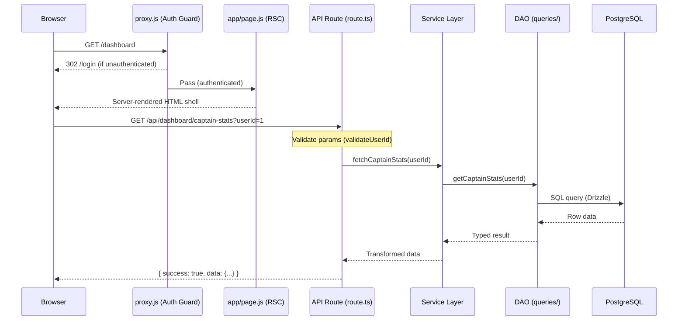

# Technical Architecture — Biwenger Stats

> Comprehensive guide to the system design, data flow, and structural decisions of the application.

---

## 1. Directory Structure

```
biwengerstats-next/
├── .github/workflows/     # CI/CD: ci.yml, sync.yml, sync-live.yml
├── .husky/                # Git hooks (pre-commit)
├── __tests__/             # Integration tests
├── docs/                  # Technical documentation
├── public/assets/         # Static images (screenshots, logos)
├── scripts/
│   ├── setup.js           # Interactive setup wizard
│   └── dev/               # Dev/debug utilities (not production)
└── src/
    ├── app/
    │   ├── (app)/         # Authenticated route group
    │   │   ├── dashboard/page.js
    │   │   ├── standings/page.js
    │   │   ├── market/page.js
    │   │   ├── rounds/page.js
    │   │   ├── player/[id]/page.js
    │   │   ├── team/[id]/page.js
    │   │   └── ...
    │   ├── api/           # Backend route handlers (56 endpoints, all .ts)
    │   │   ├── dashboard/ # Dashboard-specific endpoints
    │   │   ├── market/    # Market intelligence endpoints
    │   │   ├── standings/ # Standings & advanced stats
    │   │   ├── player/    # Player profile endpoints
    │   │   ├── rounds/    # Round history & lineup
    │   │   └── ...
    │   ├── login/page.js  # Public login page
    │   └── layout.js      # Root layout (metadata, fonts)
    ├── components/
    │   ├── dashboard/     # Dashboard card widgets
    │   ├── standings/     # Standings analysis cards
    │   ├── market/        # Market page components
    │   ├── ui/            # Reusable primitives (ErrorBoundary, CommandPalette...)
    │   └── layout/        # App shell (Navbar, ClientWrapper, AppShell)
    ├── contexts/          # React context providers (UserContext)
    └── lib/
        ├── db/
        │   ├── index.ts   # Drizzle client singleton + schema export
        │   ├── schema.ts  # Drizzle schema (all table definitions)
        │   └── queries/   # DAO layer — SQL queries by domain
        │       ├── core/  # users.ts, players.ts
        │       └── features/ # market.ts, standings.ts, rounds.ts...
        ├── hooks/         # Custom React hooks (useApiData, useTheme...)
        ├── services/      # Business logic layer
        │   ├── index.ts   # Barrel export
        │   ├── marketService.ts
        │   ├── standingsService.ts
        │   ├── playerService.ts
        │   └── ...
        ├── sync/          # ETL pipeline
        │   ├── index.ts   # Full sync orchestrator
        │   ├── live.ts    # Live-mode polling entry
        │   └── steps/     # 01-players.ts → 07-euroleague.ts
        └── utils/         # Shared typed utilities
            ├── response.ts    # API response helpers
            ├── validation.ts  # Boundary validators
            ├── analytics.ts   # Data processing
            ├── date.ts        # Date formatting
            ├── format.ts      # Display formatting
            └── fantasy-scoring.ts # Points calculation
```

---

## 2. Technology Stack

| Layer      | Technology                             | Version     |
| ---------- | -------------------------------------- | ----------- |
| Framework  | Next.js (App Router)                   | ^16.1.1     |
| Language   | TypeScript (backend) · JavaScript (UI) | —           |
| Database   | PostgreSQL                             | —           |
| ORM        | Drizzle ORM                            | ^0.45.1     |
| Auth       | Auth.js v5 (next-auth)                 | ^5.0.0-beta |
| Styling    | Tailwind CSS v4                        | ^4          |
| Animation  | Framer Motion                          | ^12         |
| Charts     | Recharts · Chart.js                    | ^3.7 · ^4.5 |
| Validation | Zod + custom validators                | ^4.3        |
| Testing    | Vitest                                 | ^4.0        |
| CI/CD      | GitHub Actions                         | —           |

> See [`docs/TECH_STACK.md`](./TECH_STACK.md) for the full rationale behind each choice.

---

## 3. Request Lifecycle



---

## 4. Database Architecture

### Connection Strategy

- **Singleton**: `src/lib/db/index.ts` creates the Drizzle client once using a `pg` connection pool and exports it as a module-level constant. This prevents pool exhaustion in long-lived server processes.
- **Drizzle ORM**: All queries are written using Drizzle's composable query builder. The schema definition in `schema.ts` generates TypeScript types, so column names and types are validated at compile time.
- **Connection Pooling**: Managed by `pg`'s built-in pool. Suitable for both long-running Docker deployments and serverless (Vercel) environments.

### Schema Overview

| Domain | Table                | Description                               |
| ------ | -------------------- | ----------------------------------------- |
| Core   | `users`              | League participants                       |
| Core   | `players`            | Player registry with current prices       |
| Core   | `teams`              | Euroleague team data                      |
| Core   | `rounds`             | Season round definitions                  |
| Stats  | `player_round_stats` | Boxscores per player per game             |
| Stats  | `user_rounds`        | Fantasy points per user per round         |
| Market | `market_values`      | Daily price snapshots                     |
| Market | `transfers`          | Buy/sell history                          |
| Logic  | `lineups`            | Who started (and captain picks) per round |
| Logic  | `player_mappings`    | Biwenger ID ↔ Euroleague ID bridge table  |

---

## 5. Service Layer Architecture

Every API route delegates all business logic to a dedicated service. The pattern is:

```
route.ts  (validate → call service → return response)
    ↓
*Service.ts  (orchestrate, aggregate, transform)
    ↓
queries/*.ts  (single-purpose SQL queries)
    ↓
PostgreSQL
```

**Example**: `GET /api/market` calls `getMarketPageData()` in `marketService.ts`, which concurrently executes 20+ queries to compute KPIs (total spend, biggest transaction, etc.) before returning one unified response object.

---

## 6. API Layer

### Endpoint Count

56 typed Route Handlers across the following feature areas:

| Prefix             | Endpoints | Area                        |
| ------------------ | --------- | --------------------------- |
| `/api/dashboard/*` | 14        | Dashboard widgets           |
| `/api/standings/*` | 6         | Standings & advanced stats  |
| `/api/market/*`    | 5         | Market intelligence         |
| `/api/rounds/*`    | 5         | Round history & lineups     |
| `/api/player/*`    | 4         | Player profiles             |
| `/api/team/*`      | 1         | Team profiles               |
| `/api/stats/*`     | 1         | Stat leaders                |
| `/api/auth/*`      | 1         | Auth.js handler             |
| Other              | ~19       | Search, news, compare, etc. |

### Response Format

All endpoints return:

```json
{ "success": true, "data": { ... } }
```

or:

```json
{ "success": false, "error": "Descriptive message" }
```

The `successResponse()` and `errorResponse()` helpers in `src/lib/utils/response.ts` enforce this shape, including standardised `Cache-Control` headers.

---

## 7. Frontend Architecture

### Server vs Client Components

| Component Type | Rendering    | Purpose                                          |
| -------------- | ------------ | ------------------------------------------------ |
| `page.js`      | Server (RSC) | HTML shell, `<head>` metadata, auth-aware layout |
| `*Client.js`   | Client       | Interactivity, state management, data fetching   |
| `*Card.js`     | Client       | Individual data widget (uses `useApiData`)       |

### `useApiData` Hook

The central data-fetching abstraction eliminates `useEffect` boilerplate across all client components:

```javascript
const { data, loading, error } = useApiData('/api/standings/full?sort=points', {
  dependencies: [userId],
  immediate: true,
});
```

It handles: loading/error state, dependency tracking, request cancellation on unmount.

### Command Palette

A `cmdk`-powered command palette (⌘K) provides global search across players, teams, and users, with keyboard navigation.

---

## 8. Authentication

Auth.js v5 provides session management. The `proxy.js` file is the authentication enforcement layer:

```javascript
// src/proxy.js — wraps every matched request
export default auth; // Auth.js handler export

export const config = {
  matcher: ['/((?!api|_next/static|_next/image|favicon.ico|login).*)'],
};
```

Unauthenticated requests to any page are redirected to `/login`. API routes (`/api/*`) are explicitly excluded from the matcher and handle their own session validation.

---

## 9. Data Synchronisation

The ETL pipeline (`src/lib/sync/`) keeps the local database in sync with two external sources:

| Source         | Data Extracted                                           |
| -------------- | -------------------------------------------------------- |
| Biwenger API   | Player prices, market transfers, fantasy scores, lineups |
| Euroleague API | Real game statistics (pts, reb, ast, blocks per player)  |

Steps run in numbered order because of data dependencies:

```
01-players → 02-users → 03-market → 04-rounds → 05-lineups → 06-matches → 07-euroleague
```

All operations use `INSERT ... ON CONFLICT DO UPDATE` (upsert) making the pipeline fully idempotent — safe to re-run without data corruption.

---

## 10. Performance & Optimisation

| Technique              | Implementation                                                                         |
| ---------------------- | -------------------------------------------------------------------------------------- |
| **Cache headers**      | `successResponse()` sets `Cache-Control: public, max-age=N, stale-while-revalidate=60` |
| **Parallel queries**   | Services use `Promise.all()` for concurrent independent queries                        |
| **DB indexing**        | `player_id`, `round_id`, `user_id`, `date` columns are indexed                         |
| **Image optimisation** | `next/image` with remote patterns for CDN-hosted player images                         |
| **Bundle analysis**    | `npm run analyze` generates a visual Webpack bundle treemap                            |
| **Turbopack**          | Development builds use Turbopack for fast HMR                                          |

---

_For patterns applied in the codebase, see [`docs/PATTERNS.md`](./PATTERNS.md). For technology selection rationale, see [`docs/TECH_STACK.md`](./TECH_STACK.md)._
