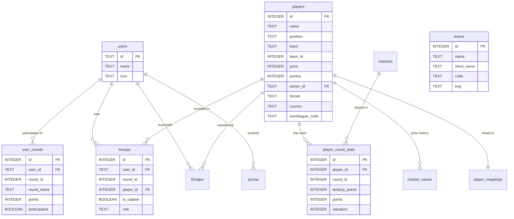

# Database Schema Documentation

This document describes the SQLite database schema used by Biwenger Stats.

## Entity Relationship Diagram



---

## Tables

### 1. `users`

League participants.

| Column | Type | Description                    |
| ------ | ---- | ------------------------------ |
| `id`   | TEXT | Primary key (Biwenger user ID) |
| `name` | TEXT | Display name                   |
| `icon` | TEXT | Avatar URL                     |

---

### 2. `players`

All players in the competition.

| Column               | Type    | Description                               |
| -------------------- | ------- | ----------------------------------------- |
| `id`                 | INTEGER | Primary key (Biwenger player ID)          |
| `name`               | TEXT    | Player name                               |
| `position`           | TEXT    | Position (Base, Alero, Pivot, Entrenador) |
| `team`               | TEXT    | Current team name                         |
| `team_id`            | INTEGER | Biwenger Team ID                          |
| `puntos`             | INTEGER | Total fantasy points                      |
| `partidos_jugados`   | INTEGER | Games played                              |
| `played_home`        | INTEGER | Home games                                |
| `played_away`        | INTEGER | Away games                                |
| `points_home`        | INTEGER | Home points                               |
| `points_away`        | INTEGER | Away points                               |
| `points_last_season` | INTEGER | Previous season points                    |
| `owner_id`           | TEXT    | FK → users.id (null if free agent)        |
| `status`             | TEXT    | Player status (ok, injured, etc.)         |
| `price_increment`    | INTEGER | Recent price change                       |
| `birth_date`         | TEXT    | Birthday (YYYY-MM-DD)                     |
| `height`             | INTEGER | Height in cm                              |
| `weight`             | INTEGER | Weight in kg                              |
| `price`              | INTEGER | Current market price                      |
| `euroleague_code`    | TEXT    | Linked EuroLeague ID (e.g. "009586")      |
| `dorsal`             | TEXT    | Jersey Number                             |
| `country`            | TEXT    | Country of origin                         |

---

### 3. `teams`

EuroLeague teams.

| Column       | Type    | Description                     |
| ------------ | ------- | ------------------------------- |
| `id`         | INTEGER | Primary key (Biwenger Team ID)  |
| `name`       | TEXT    | Team Full Name                  |
| `short_name` | TEXT    | Abbreviated Name (e.g. BAR)     |
| `code`       | TEXT    | EuroLeague Team Code (e.g. BAR) |
| `img`        | TEXT    | Team Logo URL                   |

---

### 4. `user_rounds`

User performance per round.

| Column         | Type    | Description               |
| -------------- | ------- | ------------------------- |
| `id`           | INTEGER | Primary key               |
| `user_id`      | TEXT    | FK → users.id             |
| `round_id`     | INTEGER | Round number              |
| `round_name`   | TEXT    | Round display name        |
| `points`       | INTEGER | Points scored             |
| `participated` | BOOLEAN | Whether user participated |
| `alineacion`   | TEXT    | Lineup JSON               |

**Unique constraint:** `(user_id, round_id)`

---

### 5. `fichajes`

Transfer history.

| Column      | Type    | Description     |
| ----------- | ------- | --------------- |
| `id`        | INTEGER | Primary key     |
| `timestamp` | INTEGER | Unix timestamp  |
| `fecha`     | TEXT    | Date string     |
| `player_id` | INTEGER | FK → players.id |
| `precio`    | INTEGER | Transfer price  |
| `vendedor`  | TEXT    | Seller name     |
| `comprador` | TEXT    | Buyer name      |

**Unique constraint:** `(timestamp, player_id, vendedor, comprador, precio)`

---

### 6. `lineups`

User lineups per round.

| Column       | Type    | Description                  |
| ------------ | ------- | ---------------------------- |
| `id`         | INTEGER | Primary key                  |
| `user_id`    | TEXT    | FK → users.id                |
| `round_id`   | INTEGER | Round number                 |
| `round_name` | TEXT    | Round display name           |
| `player_id`  | INTEGER | FK → players.id              |
| `is_captain` | BOOLEAN | Captain flag (double points) |
| `role`       | TEXT    | Starter/bench                |

**Unique constraint:** `(user_id, round_id, player_id)`

---

### 7. `matches`

Game schedule and results.

| Column       | Type    | Description        |
| ------------ | ------- | ------------------ |
| `id`         | INTEGER | Primary key        |
| `round_id`   | INTEGER | Round number       |
| `round_name` | TEXT    | Round display name |
| `home_team`  | TEXT    | Home team name     |
| `away_team`  | TEXT    | Away team name     |
| `home_id`    | INTEGER | FK → teams.id      |
| `away_id`    | INTEGER | FK → teams.id      |
| `date`       | DATE    | Game date          |
| `status`     | TEXT    | pending/finished   |
| `home_score` | INTEGER | Home team score    |
| `away_score` | INTEGER | Away team score    |

**Unique constraint:** `(round_id, home_team, away_team)`

---

### 8. `player_round_stats`

Detailed player statistics per round.

| Column                   | Type    | Description           |
| ------------------------ | ------- | --------------------- |
| `id`                     | INTEGER | Primary key           |
| `player_id`              | INTEGER | FK → players.id       |
| `round_id`               | INTEGER | Round number          |
| `fantasy_points`         | INTEGER | Fantasy points scored |
| `minutes`                | INTEGER | Minutes played        |
| `points`                 | INTEGER | Real game points      |
| `two_points_made`        | INTEGER | 2PT made              |
| `two_points_attempted`   | INTEGER | 2PT attempted         |
| `three_points_made`      | INTEGER | 3PT made              |
| `three_points_attempted` | INTEGER | 3PT attempted         |
| `free_throws_made`       | INTEGER | FT made               |
| `free_throws_attempted`  | INTEGER | FT attempted          |
| `rebounds`               | INTEGER | Total rebounds        |
| `assists`                | INTEGER | Assists               |
| `steals`                 | INTEGER | Steals                |
| `blocks`                 | INTEGER | Blocks                |
| `turnovers`              | INTEGER | Turnovers             |
| `fouls_committed`        | INTEGER | Personal fouls        |
| `valuation`              | INTEGER | PIR (Valoración)      |

**Unique constraint:** `(player_id, round_id)`

---

### 9. `porras`

User predictions/guesses per round.

| Column       | Type    | Description        |
| ------------ | ------- | ------------------ |
| `id`         | INTEGER | Primary key        |
| `user_id`    | TEXT    | FK → users.id      |
| `round_id`   | INTEGER | Round number       |
| `round_name` | TEXT    | Round display name |
| `result`     | TEXT    | Prediction result  |
| `aciertos`   | INTEGER | Correct guesses    |

**Unique constraint:** `(user_id, round_id)`

---

### 10. `market_values`

Player price history.

| Column      | Type    | Description     |
| ----------- | ------- | --------------- |
| `id`        | INTEGER | Primary key     |
| `player_id` | INTEGER | FK → players.id |
| `price`     | INTEGER | Price at date   |
| `date`      | DATE    | Record date     |

**Unique constraint:** `(player_id, date)`

---

### 11. `transfer_bids`

Bids on transfers (auction).

| Column        | Type    | Description      |
| ------------- | ------- | ---------------- |
| `id`          | INTEGER | Primary key      |
| `transfer_id` | INTEGER | FK → fichajes.id |
| `bidder_id`   | TEXT    | Bidder user ID   |
| `bidder_name` | TEXT    | Bidder name      |
| `amount`      | INTEGER | Bid amount       |

---

### 12. `player_mappings` (Internal)

Links Biwenger IDs to EuroLeague IDs.

| Column            | Type    | Description                      |
| ----------------- | ------- | -------------------------------- |
| `biwenger_id`     | INTEGER | Primary key (FK → players.id)    |
| `euroleague_code` | TEXT    | EuroLeague Player Code (Unique)  |
| `details_json`    | TEXT    | Raw JSON/XML from EuroLeague API |

---

### 13. `sync_meta` (Configuration)

Key-value store for sync configuration.

| Column       | Type | Description       |
| ------------ | ---- | ----------------- |
| `key`        | TEXT | Config key        |
| `value`      | TEXT | Config value      |
| `updated_at` | TEXT | Last updated time |

---

## Indexes

The following indexes are created for query performance:

```sql
-- User rounds
CREATE INDEX idx_user_rounds_user ON user_rounds(user_id);
CREATE INDEX idx_user_rounds_round ON user_rounds(round_id);

-- Players
CREATE INDEX idx_players_owner ON players(owner_id);
CREATE INDEX idx_players_team ON players(team);
CREATE INDEX idx_players_position ON players(position);

-- Lineups
CREATE INDEX idx_lineups_user ON lineups(user_id);
CREATE INDEX idx_lineups_round ON lineups(round_id);
CREATE INDEX idx_lineups_captain ON lineups(user_id, round_id, is_captain);

-- Player stats
CREATE INDEX idx_player_stats_player ON player_round_stats(player_id);
CREATE INDEX idx_player_stats_round ON player_round_stats(round_id);

-- Transfers
CREATE INDEX idx_fichajes_player ON fichajes(player_id);
CREATE INDEX idx_fichajes_timestamp ON fichajes(timestamp);

-- Matches
CREATE INDEX idx_matches_round ON matches(round_id);
CREATE INDEX idx_matches_date ON matches(date);

-- Market values
CREATE INDEX idx_market_values_player ON market_values(player_id);
CREATE INDEX idx_market_values_date ON market_values(date);
```

---

## Data Flow

```
Biwenger API → Sync Scripts → SQLite DB → Query Functions → API Routes → React Components
```

1. **Sync scripts** fetch data from Biwenger API
2. Data is stored in SQLite
3. **Query functions** read from SQLite
4. **API routes** call query functions
5. **React components** fetch from API routes
