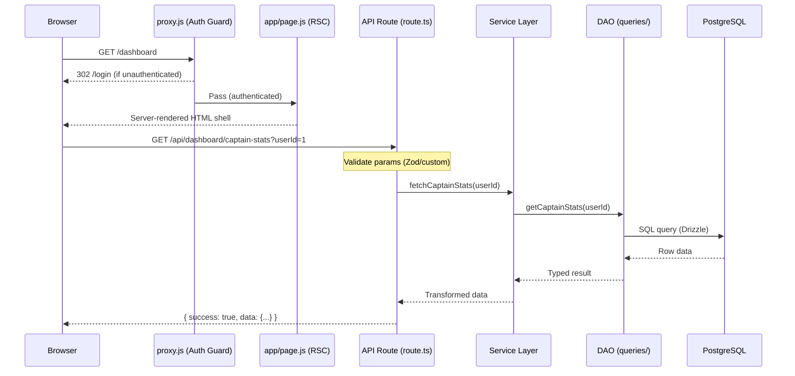

# System Guide — Biwenger Stats

> A comprehensive reference for the architecture, technology stack, and system design of the application.

---

## 1. Directory Structure

```
biwengerstats-next/
├── .agents/               # AI Instructions & Knowledge (INSTRUCTIONS.md)
├── .github/               # CI/CD: ci.yml, sync-live.yml
├── .husky/                # Git hooks (pre-commit)
├── __tests__/             # Integration tests (Vitest)
├── docs/                  # Technical documentation
├── public/assets/         # Static images (screenshots, logos)
├── scripts/               # Setup & maintenance scripts
└── src/
    ├── app/               # Next.js App Router
    │   ├── (app)/         # Authenticated route group
    │   ├── api/           # Backend route handlers (TypeScript)
    │   └── layout.js      # Global shell
    ├── components/        # UI Layer (Atomic components & features)
    ├── contexts/          # React Context (User/Auth)
    ├── lib/               # Shared logic
    │   ├── db/            # Drizzle ORM (Schema + DAO)
    │   ├── services/      # Business logic layer
    │   ├── sync/          # ETL Pipeline (Sync steps)
    │   └── utils/         # Typed utilities
    └── styles/            # Global Tailwind CSS
```

---

## 2. Core Technology Stack

| Layer      | Technology                | Version    | Purpose                               |
| ---------- | ------------------------- | ---------- | ------------------------------------- |
| Framework  | **Next.js (App Router)**  | `^16.1.1`  | Full-stack routing, SSR, RSC          |
| Language   | **TypeScript**            | `^5.7.3`   | Type-safe backend and data layer      |
| Database   | **PostgreSQL**            | `16`       | Relational data store                 |
| ORM        | **Drizzle ORM**           | `^0.45.1`  | Type-safe SQL query builder           |
| Auth       | **Auth.js v5 (NextAuth)** | `^5.0.0`   | Session-based authentication          |
| Styling    | **Tailwind CSS v4**       | `^4.0.0`   | Utility-first styling                 |
| Animation  | **Framer Motion**         | `^12.26.1` | Declarative UI transitions            |
| Charts     | **Recharts**              | `^3.7.0`   | Primary responsive data visualisation |
| Validation | **Zod**                   | `^4.3.6`   | Runtime schema validation             |
| Testing    | **Vitest**                | `^4.0.14`  | Unit and integration tests            |

### Rationale & Selection

- **Next.js 16**: Chosen for the App Router's efficiency with Server Components and Turbopack's speed.
- **Drizzle Over Prisma**: Provides a thinner abstraction that stays closer to raw SQL, which is critical for the complex analytical queries used in league standings.
- **Tailwind v4**: Leverages native CSS variables for the theme system, resulting in zero-runtime CSS.
- **Strategy Pattern**: UI stats are resolved via a shared registry (`registry.js`) rather than hardcoded logic.

---

## 3. Request Lifecycle

The application follows a strict unidirectional data flow:



---

## 4. Database Architecture

### Connection Strategy

- **Singleton**: `src/lib/db/index.ts` instantiates the Drizzle client with a `pg` connection pool.
- **DAO Pattern**: SQL queries are isolated in `src/lib/db/queries/`. Routes never talk to `db` directly; they use Services.

### Key Schema Areas

- **`players`**: Registry with current prices and mapping to Euroleague IDs.
- **`player_round_stats`**: Time-series table storing every boxscore for every round.
- **`market_values`**: Snapshots for daily price evolution charts.
- **`user_lineups`**: Historical record of which players were played in which roles.

---

## 5. Service Layer Architecture

Every API route delegates all business logic to a dedicated service:

1.  **Route Handler**: Thin wrapper; handles HTTP, validation, and status codes.
2.  **Service**: Orchestrates data. often calls multiple DAO queries in parallel via `Promise.all()`.
3.  **DAO (Data Access Object)**: Pure SQL query logic. No business logic here.

---

## 6. Performance & Optimisation

- **RSC Boundaries**: Only interactive elements are Client Components; layouts and shells are Server Components.
- **Stale-While-Revalidate**: API responses use `Cache-Control` headers configured for rapid revalidation.
- **Turbopack**: Used for development builds to minimize HMR latency.
- **Image CDN**: Player images are served via the Biwenger CDN and optimized through `next/image`.

---

_For specific implementation patterns, see [`docs/PATTERNS.md`](./PATTERNS.md). For feature definitions, see [`docs/FEATURES.md`](./FEATURES.md)._
