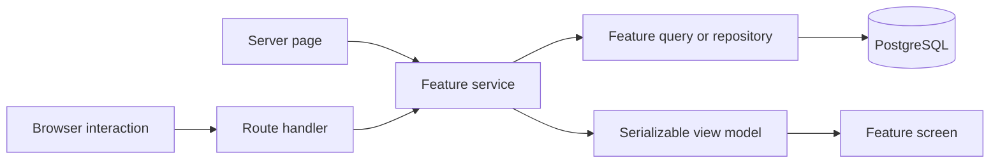

# Application layers

New and migrated domain code belongs in `src/features/<feature>`. The current
[domain ledger](migration-status.md) identifies integrated features, pending work, and exceptions.
Matches and Teams are integrated on main; check the ledger and actual branch before selecting a base.

## Read flow

Server Components call feature services directly. Route Handlers adapt existing HTTP contracts to
those same services. Internal REST exists for browser or external consumers, not as a mandatory hop
between code already running on the server.

## Responsibilities and contracts

- Pages/layouts parse framework inputs, invoke services, and compose screens.
- Route Handlers authenticate/authorize deliberately, validate HTTP inputs, invoke services, and
  preserve response envelopes, status codes, caching, and observable errors.
- Feature services orchestrate domain reads, declare access and freshness policies, and return
  explicit view models through mappers.
- Feature queries/repositories own SQL and Drizzle; presentation code receives no raw database rows.
- `public.ts` exposes client-safe components, models, and types. `server.ts` starts with
  `import 'server-only'` and exposes deliberate server contracts.
- Cross-feature consumers use `public.ts` or `server.ts`, including type imports. Shared code needs
  demonstrated reuse and clear ownership.
- Client Components own browser interaction and local state. Server-to-client props are serializable.
  Desktop and mobile compositions share the domain model and preserve information parity.

Use [Matches](../../src/features/matches/server.ts) and [Teams](../../src/features/teams/server.ts)
as concrete examples, while checking their documented remaining limitations. Run `npm run architecture:check`
for graph enforcement; its scope and explicit legacy exceptions are described in
[agent workflow](../contributing/agent-workflow.md).

## Legacy compatibility

Unmigrated code continues to use [global services](../../src/lib/services),
[queries](../../src/lib/db/queries), and [mutations](../../src/lib/db/mutations).
Existing browser consumers may use [useApiData](../../src/lib/hooks/useApiData.js) and
[API helpers](../../src/lib/utils/response.ts). Do not rewrite those consumers as incidental cleanup.

URLs, query parameters, authentication, caching, response shapes, ordering, and visual behavior are
compatibility contracts. New canonical HTTP names require an intentional contract change; a
structural migration alone does not authorize aliases, pagination, envelope normalization, or removal.
Consult the [internal API reference](../reference/internal-api.md) and real route tests.

Authentication, credentials, synchronization, and database infrastructure retain their existing
ownership and safety rules. Do not create artificial feature wrappers for framework infrastructure.
