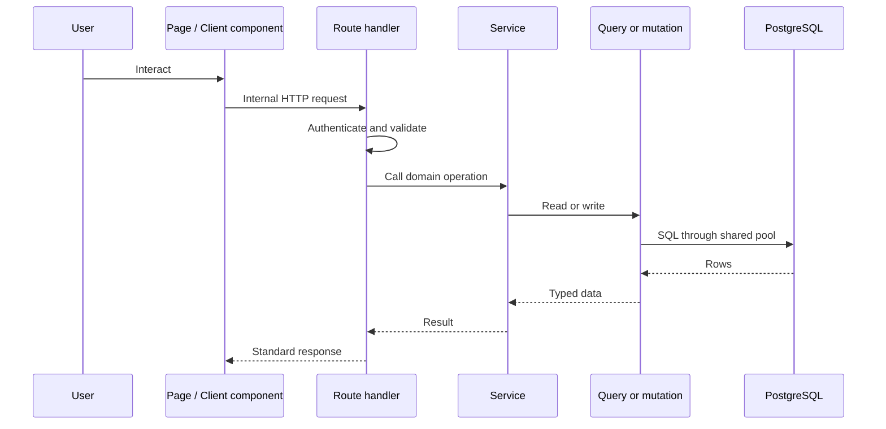

# Application layers

New data-backed features should normally follow this direction:

## Boundaries

- **Pages and components** own presentation, interaction, and route-level composition. Most
  authenticated page entries live under [`src/app/(app)`](<../../src/app/(app)>).
- **Route handlers** own HTTP parsing, authentication, validation, response status, and cache
  headers. They live under [`src/app/api`](../../src/app/api).
- **Services** combine queries, apply business rules, and shape domain responses. Server-exclusive
  services should import `server-only`.
- **Queries** in [`src/lib/db/queries`](../../src/lib/db/queries) read data. **Mutations** in
  [`src/lib/db/mutations`](../../src/lib/db/mutations) write it.
- [`src/lib/db/index.ts`](../../src/lib/db/index.ts) exposes the Drizzle client and a temporary legacy
  `pg` bridge over one shared pool.

The repository is still completing this separation. A small number of route handlers access Drizzle
or mutations directly, particularly authentication, account, and Hoopgrid routes. Treat those as
explicit current-state exceptions, not examples for unrelated new endpoints.

## Client data flow

Interactive JavaScript components commonly fetch internal APIs with
[`useApiData`](../../src/lib/hooks/useApiData.js). HTTP responses normally use the helpers in
[`response.ts`](../../src/lib/utils/response.ts) to return either `{ success: true, data }` or
`{ success: false, error }`.

Some App Router pages and specialized endpoints use different shapes. Consult the
[internal API reference](../reference/internal-api.md) and route tests before changing a contract.

## Server and Client Components

Page modules default to Server Components unless marked with `use client`. Interactive domain
components commonly provide a `*Client.js` boundary. Keep secrets, direct database access, and
provider credentials on the server side; pass only required serializable data into client code.
