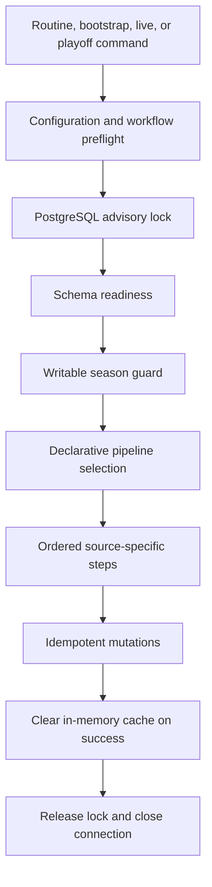

# Data and sync architecture

The application is local-first with respect to analytics: provider data is ingested into PostgreSQL
before normal product pages query it. The assistant is the main runtime exception because it can
call OpenAI after building context from local data.

## Database access

[`src/lib/db/client.ts`](../../src/lib/db/client.ts) owns a shared `pg` pool. The pool is wrapped by
Drizzle in [`src/lib/db/index.ts`](../../src/lib/db/index.ts), which also exposes a legacy raw-client
bridge while migration is in progress. [`schema.ts`](../../src/lib/db/schema.ts) is the application
schema source; [`schema_init.ts`](../../src/lib/db/schema_init.ts) remains a transitional bootstrap
and readiness layer.

Data is grouped around:

- Core entities such as seasons, players, teams, users, rounds, and matches.
- Season facts such as lineups, standings, ownership, transfers, prices, and player statistics.
- Feature data for tournaments, predictions, assistant conversations, and Hoopgrid.

Use the [data model reference](../reference/data-model.md) for table-level ownership.

## Synchronization flow

The command boundary is [`src/lib/sync/index.ts`](../../src/lib/sync/index.ts). The ordered contract
lives in [`pipeline.ts`](../../src/lib/sync/pipeline.ts): every step declares a descriptive ID, its
source, the tables or fields it owns, its supported modes, and its dependencies. There are no
numeric aliases or hidden retired steps.

[`SyncManager`](../../src/lib/sync/manager.ts) acquires the advisory lock, verifies schema readiness,
resolves a writable season, executes the selected steps in order, and stops on the first failure.
Routine, bootstrap, and live execution share the same advisory-lock key, so they cannot overlap.

Provider boundaries are explicit:

- Biwenger owns fantasy identities, users, rounds, fantasy points, lineups, board history,
  ownership, market listings, and tournaments.
- EuroLeague Advanced API owns the official calendar, mappings, standings, sporting game data,
  profiles, crests, play-by-play, and shots.
- `matches` joins both worlds, but its sporting fields are copied only from `official_games`.

The EuroLeague integration is split into a validated HTTP client under
[`src/lib/api/euroleague`](../../src/lib/api/euroleague), orchestration services under
[`src/lib/sync/services/euroleague`](../../src/lib/sync/services/euroleague), and focused database
mutations under [`src/lib/db/mutations/official`](../../src/lib/db/mutations/official). The legacy
XML/API implementation is preserved in the `archive/euroleague-legacy-2025-26` Git tag rather than
remaining on the active execution path.

## Invariants

- Mutating sync runs target one configured season and reject missing, unknown, non-active, or
  provider-mismatched seasons.
- Production future-season writes require confirmed season-aware reads.
- Concurrent sync workers must not write through the same advisory-lock scope.
- Sync mutations should be idempotent so a stopped pipeline can be safely rerun.
- Any step failure stops the current pipeline; partial successful writes remain safe to rerun.
- Production schema mutation must never be hidden inside routine sync execution.
- Sporting totals and Biwenger fantasy points have separate mutations and cannot overwrite one
  another.
- Current ownership has a single writer (`biwenger-squads`); board ingestion never infers ownership.

Follow [database safety](../operations/database-safety.md), [season lifecycle](../operations/season-lifecycle.md),
and the [data sync runbook](../operations/data-sync.md) before executing commands.
