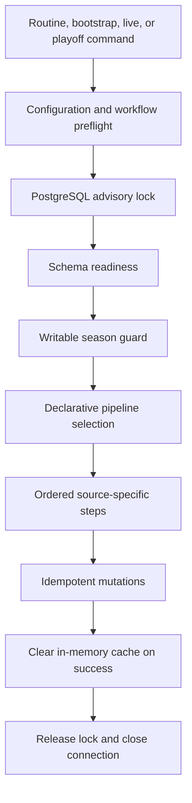
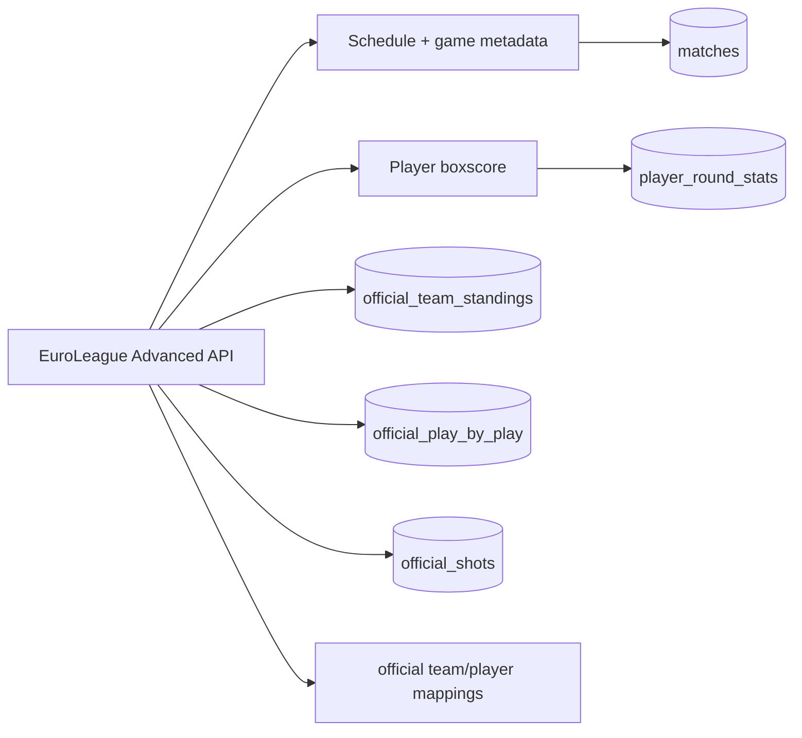

# Data and sync architecture

The application is local-first with respect to analytics: provider data is ingested into PostgreSQL
before normal product pages query it. The assistant is the main runtime exception because it can
call OpenAI after building context from local data.

## Database access and ownership

[`src/lib/db/client.ts`](../../src/lib/db/client.ts) owns the shared `pg` pool and canonical Drizzle instance.
[`schema.ts`](../../src/lib/db/schema.ts) is the application schema source;
[`schema-validation.ts`](../../src/lib/db/schema-validation.ts) provides read-only schema readiness validation.
Committed Drizzle migrations are the only schema-mutation authority; routine application and sync
execution do not perform runtime DDL.

The current model separates durable identity from season-dependent state:

- Global identities: `users`, `players`, and `teams`.
- Season-scoped state: `user_seasons`, `player_seasons`, and `team_seasons`.
- Season facts: matches, manager rounds, lineups, ownership, transfers, prices, market listings,
  financial events, predictions, and player statistics.
- Official specialized data: mappings, team standings, play-by-play, and shots.
- Feature data: tournaments, assistant conversations, Hoopgrid, and synchronization metadata.

Global identity rows do not own attributes that vary by season. The exact table contract is in the
[data model reference](../reference/data-model.md), and the rationale is recorded in
[ADR-0005](../decisions/0005-season-scoped-domain-model.md).

## Synchronization flow

The command boundary is [`src/lib/sync/index.ts`](../../src/lib/sync/index.ts). The ordered contract
lives in [`pipeline.ts`](../../src/lib/sync/pipeline.ts): every step declares a descriptive ID, its
source, the tables or fields it owns, its supported modes, and its dependencies. There are no
numeric aliases or hidden retired steps.

[`SyncManager`](../../src/lib/sync/manager.ts) acquires the advisory lock, verifies schema readiness,
resolves a writable season, executes the selected steps in order, and stops on the first failure.
Routine, bootstrap, and live execution share the same advisory-lock key, so they cannot overlap.

## Provider ownership and persistence

Provider boundaries are explicit:

- Biwenger owns fantasy identities, manager membership, rounds, fantasy points, lineups, board
  history, ownership, market listings, transfers, finances, and tournaments.
- EuroLeague Advanced API owns the official calendar, team/player mappings, team standings,
  sporting game data, season profiles, crests, play-by-play, and shots.
- A persisted match links the fantasy competition to an official EuroLeague game code, but sporting
  schedule, status, score, venue, and game metadata come from the EuroLeague integration.
- Player round rows can contain both Biwenger fantasy values and official sporting metrics, but
  those field groups have separate mutations and write ownership so one provider cannot overwrite
  the other provider's data.

The current official-data persistence model is:

Game-level official staging tables are no longer part of the current schema. Official schedule and
game state are consolidated into `matches`, while materialized player game/round metrics are stored
in `player_round_stats`. Granular play-by-play and shot data remain in their dedicated tables.

The EuroLeague integration is split into a validated HTTP client under
[`src/lib/api/euroleague`](../../src/lib/api/euroleague), orchestration services under
[`src/lib/sync/services/euroleague`](../../src/lib/sync/services/euroleague), and focused database
mutations under [`src/lib/db/mutations/official`](../../src/lib/db/mutations/official). The legacy
XML/API implementation is preserved in the `archive/euroleague-legacy-2025-26` Git tag rather than
remaining on the active execution path.

## Invariants

- Mutating sync runs target one configured season and reject missing, unknown, non-active, or
  provider-mismatched seasons.
- Production future-season writes require confirmed season-aware reads.
- Season-varying player, team, and manager state must be written to its seasonal record rather than
  reintroduced on the global identity table.
- Concurrent sync workers must not write through the same advisory-lock scope.
- Sync mutations should be idempotent so a stopped pipeline can be safely rerun.
- Any step failure stops the current pipeline; partial successful writes remain safe to rerun.
- Production schema mutation must never be hidden inside routine sync execution.
- Sporting totals and Biwenger fantasy points have separate mutations and cannot overwrite one another.
- Current ownership has a single writer (`biwenger-squads`); board ingestion never infers ownership.

Follow [database safety](../operations/database-safety.md), [season lifecycle](../operations/season-lifecycle.md),
and the [data sync runbook](../operations/data-sync.md) before executing commands.
