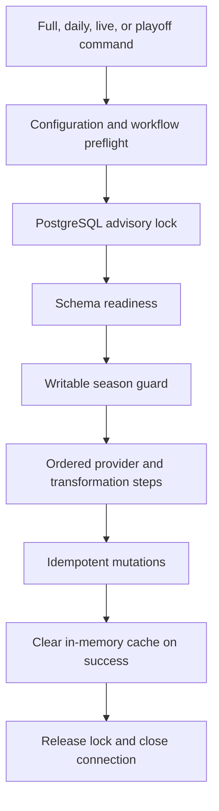

# Data and sync architecture

The application is local-first with respect to analytics: provider data is ingested into PostgreSQL
before normal product pages query it. The assistant is the main runtime exception because it can
call OpenAI after building context from local data.

## Database access

[`src/lib/db/client.ts`](../../src/lib/db/client.ts) owns a shared `pg` pool. The pool is wrapped by
Drizzle in [`src/lib/db/index.ts`](../../src/lib/db/index.ts), which also exposes a legacy raw-client
bridge while migration is in progress. [`schema.ts`](../../src/lib/db/schema.ts) is the application
schema source; [`schema_init.ts`](../../src/lib/db/schema_init.ts) remains a transitional bootstrap
and readiness layer.

Data is grouped around:

- Core entities such as seasons, players, teams, users, rounds, and matches.
- Season facts such as lineups, standings, ownership, transfers, prices, and player statistics.
- Feature data for tournaments, predictions, assistant conversations, and Hoopgrid.

Use the [data model reference](../reference/data-model.md) for table-level ownership.

## Synchronization flow

The main orchestrator is [`src/lib/sync/index.ts`](../../src/lib/sync/index.ts). It registers 15
numbered steps and supports full, daily, and single-step execution. Step 11 is intentionally skipped
in normal full/daily runs because its upstream image source is blocked; it can be invoked explicitly
or replaced by the maintained CSV/image tooling.

[`SyncManager`](../../src/lib/sync/manager.ts) acquires the advisory lock, verifies schema readiness,
resolves a writable season, executes registered steps, and fails fast on critical errors unless the
explicit continuation option is used.

## Invariants

- Mutating sync runs target one configured season and reject missing, unknown, non-active, or
  provider-mismatched seasons.
- Production future-season writes require confirmed season-aware reads.
- Concurrent sync workers must not write through the same advisory-lock scope.
- Sync mutations should be idempotent so a stopped pipeline can be safely rerun.
- Critical-step failure stops dependent work by default.
- Production schema mutation must never be hidden inside routine sync execution.

Follow [database safety](../operations/database-safety.md), [season lifecycle](../operations/season-lifecycle.md),
and the [data sync runbook](../operations/data-sync.md) before executing commands.
