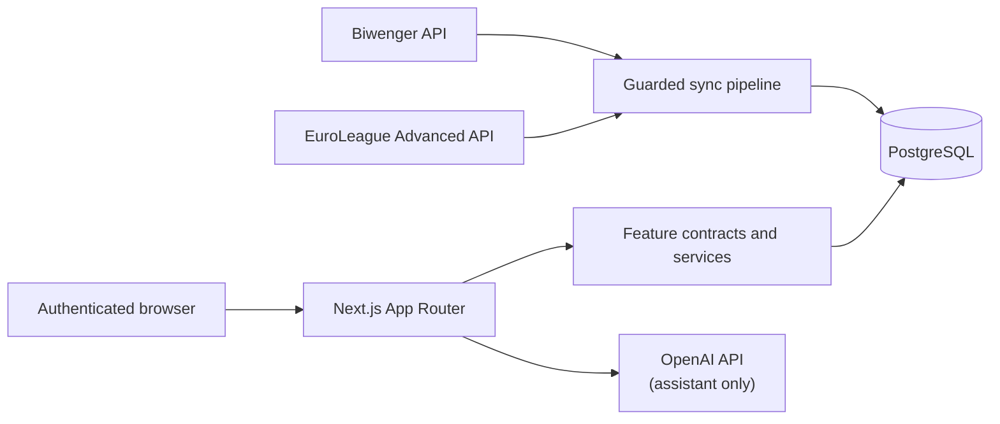
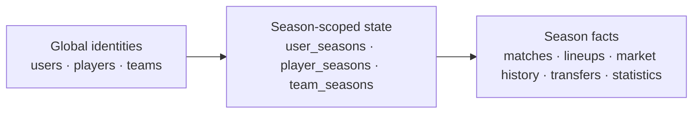

# System overview

Biwenger Stats is a Next.js App Router application for private Biwenger EuroLeague competitions. It
combines fantasy-league state from Biwenger with official sporting data from the EuroLeague Advanced
API, stores the resulting history in PostgreSQL, and exposes analytics, live views, market tools,
and league-management features through an authenticated application.

The product is local-first with respect to analytics: normal pages query synchronized PostgreSQL
state instead of calling providers during each request. The assistant is the main runtime exception
because it can call OpenAI after building context from local application data.

## System context

Synchronization is infrastructure rather than a product feature because it coordinates multiple
business domains. The command boundary lives under [`src/lib/sync`](../../src/lib/sync), while
migrated product domains own their read contracts, services, queries, models, and screens under
[`src/features`](../../src/features).

## Data model at a glance

The multi-season model separates durable identity from attributes and facts that can change between
seasons:

A player, team, or user can therefore keep one durable identity while its team membership, price,
manager presentation, venue information, ownership, and other season-dependent state live in the
corresponding seasonal model. Exact table ownership is documented in the
[data model reference](../reference/data-model.md).

## Runtime responsibilities

- **Feature domains** own migrated business contracts, orchestration, queries, mappers, view models,
  and screens under [`src/features`](../../src/features).
- **App Router** pages, layouts, and internal HTTP handlers live under [`src/app`](../../src/app) and
  remain thin framework adapters as domains migrate.
- **Shared UI** under [`src/components`](../../src/components) owns the shell and genuinely reusable
  presentation. Domain-specific components move with their feature ownership.
- **Legacy application services and queries** under [`src/lib/services`](../../src/lib/services) and
  [`src/lib/db/queries`](../../src/lib/db/queries) remain only for unmigrated consumers and deliberate
  compatibility adapters.
- **Database infrastructure** under [`src/lib/db`](../../src/lib/db) owns the Drizzle schema, shared
  PostgreSQL client, focused mutations, validation, and migration/readiness tooling.
- **Synchronization** under [`src/lib/sync`](../../src/lib/sync) owns provider ingestion,
  normalization, mapping, locking, ordered execution, and season-safe writes.
- **Authentication and credential boundaries** are implemented by Auth.js plus server-only helpers;
  personal Biwenger credentials never enter client contracts or JWT session payloads.

Read [application layers](application-layers.md) for the target request flow and compatibility rules.

## Key invariants

- Season-varying state belongs in season-scoped records rather than global identity tables.
- Mutating sync runs target one configured writable season and fail closed on unknown or mismatched
  provider bindings.
- Sync modes share PostgreSQL advisory locking and use idempotent writes so interrupted runs can be
  retried safely.
- EuroLeague sporting data and Biwenger fantasy data have explicit write ownership; one source must
  not silently overwrite the other source's fields.
- Database schema changes are committed Drizzle migrations. Routine runtime code and synchronization
  do not perform hidden DDL.
- Application database access is server-side. Public Supabase API roles have no application-object
  privileges, while route/service authorization remains an application responsibility.

The detailed ingestion and persistence contract is in [data and sync](data-and-sync.md), and the
security boundary is in [authentication and security](authentication-and-security.md).

## Deployment topology

The provided Docker Compose definition contains PostgreSQL, the Next.js application, and a separate
sync worker. The application can instead use a remote PostgreSQL database through `DATABASE_URL`.
Production scheduling is implemented through GitHub Actions workflows rather than through a
Next.js request lifecycle.

See the [Docker runbook](../operations/docker.md) and [data sync runbook](../operations/data-sync.md)
for procedures. Operational credentials, backup commands, and recovery steps intentionally live in
runbooks rather than in this architecture note.

## Technology baseline

The exact versions are owned by `package.json` and the lockfile. At a high level the application
uses Next.js 16, React 19, PostgreSQL, Drizzle ORM, Auth.js v5, Tailwind CSS v4, Framer Motion,
Recharts/Chart.js, Zod, Vitest, and Playwright.

## Continue reading

- [Application layers](application-layers.md) — feature boundaries and request flow.
- [Data and sync](data-and-sync.md) — provider ownership, persistence, and synchronization safety.
- [Authentication and security](authentication-and-security.md) — sessions, credentials, APIs, and database access.
- [Migration overview](migration-overview.md) — current architecture-migration coverage and remaining work.
- [Architecture decisions](../decisions/README.md) — why the major engineering choices were made.
