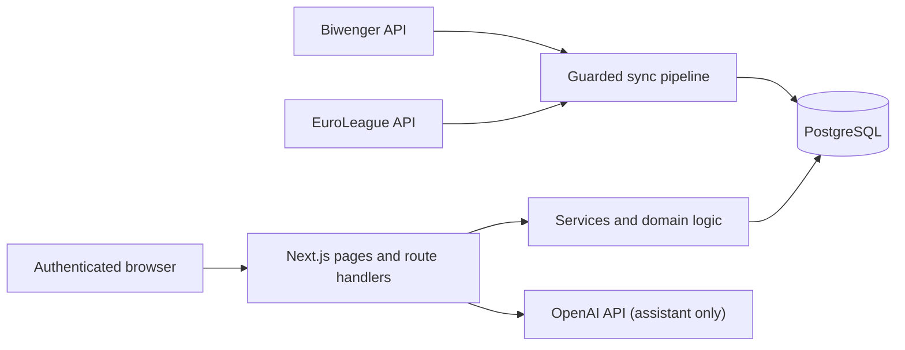

# System overview

Biwenger Stats is a Next.js App Router application backed by PostgreSQL. It imports private-league
data from Biwenger, combines it with official EuroLeague data, and exposes the resulting analytics
through authenticated pages and internal route handlers.

## Runtime responsibilities

| Area         | Responsibility                                                  | Primary source                               |
| ------------ | --------------------------------------------------------------- | -------------------------------------------- |
| App Router   | Pages, layouts, and internal HTTP handlers                      | [`src/app`](../../src/app)                   |
| UI           | Domain components, shared layout, and primitives                | [`src/components`](../../src/components)     |
| Services     | Business orchestration and result shaping                       | [`src/lib/services`](../../src/lib/services) |
| Data access  | Drizzle schema, SQL reads, and mutations                        | [`src/lib/db`](../../src/lib/db)             |
| Sync         | Provider ingestion, transformation, locking, and ordered writes | [`src/lib/sync`](../../src/lib/sync)         |
| Auth         | Credentials, JWT sessions, and protected-page middleware        | [`src/auth.js`](../../src/auth.js)           |
| Shared logic | Scoring, standings, validation, caching, and formatting         | [`src/lib`](../../src/lib)                   |

## Deployment topology

The provided Docker Compose definition contains PostgreSQL, the Next.js application, and a separate
sync worker. The application can instead use a remote PostgreSQL database through `DATABASE_URL`.
Production scheduling is implemented through GitHub Actions workflows rather than through a
Next.js request lifecycle.

See the [Docker runbook](../operations/docker.md) and [data sync runbook](../operations/data-sync.md)
for procedures. This architecture note intentionally does not prescribe deployment credentials or
recovery commands.

## Technology baseline

The exact versions are owned by `package.json` and the lockfile. At a high level the application
uses Next.js 16, React 19, PostgreSQL, Drizzle ORM, Auth.js v5, Tailwind CSS v4, Framer Motion,
Recharts/Chart.js, Zod, Vitest, and Playwright.
