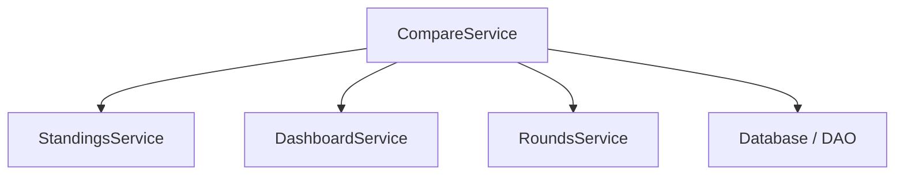

# Head-to-Head Comparison Documentation

This document consolidates all information regarding the **Head-to-Head (H2H) Comparison** feature. It includes the functional definitions of all statistics, the technical service layer architecture, and the initial audit of available metrics.

---

# Part 1: Functional Definitions & Logic

This section provides a detailed breakdown of every statistic displayed on the **Head-to-Head Comparison Card**. It explains what each stat represents, how it is calculated, and the source of the data to ensure accuracy and transparency.

## 1. General Stats (Estadísticas Generales)

These are the fundamental metrics for comparing overall season performance.

| Metric                 | Definition                                                             | Calculation                                                     | Source                                               |
| :--------------------- | :--------------------------------------------------------------------- | :-------------------------------------------------------------- | :--------------------------------------------------- |
| **Puntos Totales**     | The total accumulation of fantasy points scored throughout the season. | Sum of `points` from `user_rounds` where `participated = TRUE`. | **Historical Data** (`user_rounds` table)         |
| **Valor de Plantilla** | The total market value of the user's **current** squad.                | Sum of `price` for all players currently owned by the user.     | **Live Data** (`players` table, current snapshot) |

---

## 2. Predictions (Porras)

Stats related to the "Porra" minigame where users predict match results (1-X-2).

| Metric               | Definition                                                                                      | Calculation                                                                             | Source                                 |
| :------------------- | :---------------------------------------------------------------------------------------------- | :-------------------------------------------------------------------------------------- | :------------------------------------- |
| **Aciertos Totales** | Total number of correct match outcome predictions (1-X-2) across all rounds.                    | Sum of `aciertos` (hits).                                                               | **Porras History** (`porras` table) |
| **Media (Aciertos)** | The average number of correct predictions per participated round.                               | `Total Hits / Rounds Played`.                                                           | **Porras History**                     |
| **Jornadas Ganadas** | Number of times the user achieved the **highest score** in a specific round's prediction game.  | Count of rounds where `user_hits == max_hits_in_round`.                                 | **Porras History**                     |
| **Factor Clutch**    | Performance in recent high-pressure moments. Average hits in the **last 3 active rounds**.      | Average of `aciertos` in the most recent 3 rounds where the user participated.          | **Recent History**                     |
| **Plenos (10/10)**   | Number of times the user correctly predicted **all matches** in a single round (Perfect Score). | Count of rounds where `aciertos == 10`.                                                 | **Porras History**                     |
| **Roscos (Último)**  | Number of times the user had the **lowest score** in a round (shared or formatted).             | Count of rounds where `user_hits == min_hits_in_round` (Global minimum for that round). | **Porras History**                     |

---

## 3. Captain & Home/Away Strategy

Metrics analyzing roster management decisions and squad composition.

| Metric                | Definition                                                                                                | Calculation                                                                                                                               | Source                                                     |
| :-------------------- | :-------------------------------------------------------------------------------------------------------- | :---------------------------------------------------------------------------------------------------------------------------------------- | :--------------------------------------------------------- |
| **Puntos de Capitán** | Total **extra** points generated specifically by the Captain bonus (x2 multiplier) throughout the season. | Sum of the base fantasy points of players placed in the Captain slot. Since the bonus is +100%, the "extra" points equal the base points. | **Lineup History** (`lineups` table)                    |
| **Media Capitán**     | Average points contributed by the Captain slot per round.                                                 | `Total Captain Points (Base + Bonus) / Rounds with Captain`.                                                                              | **Lineup History**                                         |
| **Media en Casa**     | The average performance of your **current squad's players** when playing at Home.                         | Average of `points_home` for all players currently in your team.                                                                          | **Current Squad** (Player's real-life cumulative stats) |
| **Media Fuera**       | The average performance of your **current squad's players** when playing Away.                            | Average of `points_away` for all players currently in your team.                                                                          | **Current Squad** (Player's real-life cumulative stats) |

> **Note:** Home/Away stats reflect the tendencies of the players you _currently_ own, not your historical team performance.

---

## 4. Performance in Rounds (Rendimiento en Jornadas)

Stats focusing on consistency and peak performance in fantasy rounds.

| Metric               | Definition                                                             | Calculation                                                                                  | Source                                              |
| :------------------- | :--------------------------------------------------------------------- | :------------------------------------------------------------------------------------------- | :-------------------------------------------------- |
| **Eficiencia Media** | How frequently the user maximizes their potential score.               | Average of the `efficiency` metric (`actual_points / ideal_points * 100`) across all rounds. | **Historical Data** (`user_rounds`.`efficiency`) |
| **Mejor Puntuación** | The highest single-round score achieved this season.                   | `MAX(points)` from all participated rounds.                                                  | **Historical Data**                                 |
| **Forma Reciente**   | Average score over the **last 5 rounds**, indicating current momentum. | Average of `points` from the 5 most recent rounds.                                           | **Recent History**                                  |

---

## 5. Advanced: Management & Consistency

Deep-dive metrics evaluating management skill and stability.

| Metric                         | Definition                                                                     | Calculation                                                      | Source                                          |
| :----------------------------- | :----------------------------------------------------------------------------- | :--------------------------------------------------------------- | :---------------------------------------------- |
| **Jornadas Perfectas**         | Number of rounds with near-perfect lineup choices.                             | Count of rounds where `efficiency >= 99%`.                       | **Historical Data**                             |
| **Fiabilidad**                 | Determining how often a user scores "above average".                           | Percentage of rounds where `user_points > round_average_points`. | **Comparison** (User vs League calculations) |
| **Consistencia (Volatilidad)** | Measures how "swingy" a user's scores are. Lower is better (more predictable). | **Standard Deviation** of the user's round scores.               | **Statistical Analysis**                        |
| **Puntos Perdidos**            | Total points left on the bench throughout the season.                          | Sum of `(ideal_points - actual_points)` for all rounds.          | **Historical Data**                             |
| **Suelo (Floor)**              | The lowest score recorded in a participated round (worst performance).         | `MIN(points)` from participated rounds.                          | **Historical Data**                             |
| **Techo (Ceiling)**            | Synonymous with "Best Score" but used in floor/ceiling context.                | `MAX(points)` from participated rounds.                          | **Historical Data**                             |

---

## 6. Advanced: Dominance & Competitive Profile

Metrics analyzing how the user stacks up against the competition.

| Metric                  | Definition                                                                        | Calculation                                                                                     | Source             |
| :---------------------- | :-------------------------------------------------------------------------------- | :---------------------------------------------------------------------------------------------- | :----------------- |
| **Margen de Victoria**  | When the user wins a round, how much do they win by?                              | Average difference between User Points and 2nd Place Points in rounds where `User Rank == 1`.   | **League Context** |
| **Rendimiento vs Liga** | Average point differential against the league average.                            | Average of `(user_points - league_avg_points)` per round. Positive = Outperforming averages.    | **League Context** |
| **Gap Teórico**         | How far the user is from a "Perfect Season" (winning every round with max score). | `(Sum of All Round Max Scores) - (User Total Points)`. Expressed as % of total possible points. | **League Context** |

---

## 7. Advanced: Streaks, Hitos & Fun Stats

Narrative-driven statistics highlighting unique patterns.

| Metric                     | Definition                                                                 | Calculation                                                                                     | Source                |
| :------------------------- | :------------------------------------------------------------------------- | :---------------------------------------------------------------------------------------------- | :-------------------- |
| **Racha Actual**           | Current number of consecutive rounds with "Elite" scoring (Active).        | Consecutive rounds counting back from the latest round with `points >= 175`.                    | **Historical Data**   |
| **Racha Histórica**        | Longest streak of "Elite" scoring achieved at any point in the season.     | Max consecutive rounds with `points >= 175`.                                                    | **Historical Data**   |
| **Racha de Fuego**         | Comparing current form vs season average.                                  | `(Last 5 Rounds Avg) - (Season Avg)`. High positive = On Fire; High negative = Ice Cold.        | **Trend Analysis**    |
| **Cazador (Hunter)**       | Points gained on the current Leader in recent rounds.                      | `(User Last 5 Pts) - (Leader Last 5 Pts)`. Measures comeback momentum.                          | **Trend Analysis**    |
| **Pecho Frío (Bottler)**   | A score measuring "almost winning". penalizes 2nd/3rd places without wins. | Formula: `(Seconds * 3 + Thirds * 1) - (Wins * 2)`. High score means many podiums but few wins. | **Rank Distribution** |
| **Mala Suerte (No Glory)** | Total points scored in rounds where the user did **not** win.              | Sum of points in rounds where `Rank > 1`. "Wasted" high scores.                                 | **Historical Data**   |

---

# Part 2: Technical Architecture & Service Layer

This section details the technical implementation of the data retrieval. The `CompareService` acts as an **orchestrator**, reusing specialized methods from other domain services (`Standings`, `Dashboard`, `Rounds`) to build the comparison dataset without duplicating business logic.

## Architecture Overview

The `getComparisonData()` function in `src/lib/services/compareService.js` aggregates data from 4 main sources:

## Service Method Mapping

### 1. General Stats (Estadísticas Generales)

These stats come from the core standings queries, reused from the main Standings page.

| Metric                 | Service Method Cal | Origin File           | Underlying Query         |
| :--------------------- | :----------------- | :-------------------- | :----------------------- |
| **Puntos Totales**     | `getStandings()`   | `src/lib/db/index.js` | `getExtendedStandings()` |
| **Valor de Plantilla** | `getStandings()`   | `src/lib/db/index.js` | `getExtendedStandings()` |

> **Note:** `compareService` imports `getExtendedStandings` as `getStandings` direclty from the DB layer for performance, as it is the foundational query.

### 2. Predictions (Porras)

Data for the predictions minigame.

| Metric                   | Service Method Call | Origin File           | Underlying Query                                                             |
| :----------------------- | :------------------ | :-------------------- | :--------------------------------------------------------------------------- |
| **All Prediction Stats** | `getPorrasStats()`  | `src/lib/db/index.js` | `getPorrasStats()` _(Aggregates `getAchievements`, `getTableStats`, etc)_ |

### 3. Captain & Home/Away Strategy

These stats are reused from the **Dashboard** "User Analysis" widgets.

| Metric                  | Service Method Call       | Origin File                            | Underlying Query         |
| :---------------------- | :------------------------ | :------------------------------------- | :----------------------- |
| **Puntos de Capitán**   | `fetchCaptainStats(uid)`  | `src/lib/services/dashboardService.js` | `getUserCaptainStats()`  |
| **Media Capitán**       | `fetchCaptainStats(uid)`  | `src/lib/services/dashboardService.js` | `getUserCaptainStats()`  |
| **Media en Casa/Fuera** | `fetchHomeAwayStats(uid)` | `src/lib/services/dashboardService.js` | `getUserHomeAwayStats()` |

### 4. Performance in Rounds (Rendimiento en Jornadas)

These stats are derived from the full round history, reused from the **User Profile** and **Rounds** pages.

| Metric               | Service Method Call                     | Origin File                         | Underlying Query                                                   |
| :------------------- | :-------------------------------------- | :---------------------------------- | :----------------------------------------------------------------- |
| **Eficiencia Media** | `getUserPerformanceHistoryService(uid)` | `src/lib/services/roundsService.js` | `getUserRoundsHistoryDAO()` _(Calculates efficiency in-memory)_ |
| **Mejor Puntuación** | `getUserPerformanceHistoryService(uid)` | `src/lib/services/roundsService.js` | `getUserRoundsHistoryDAO()`                                        |
| **Forma Reciente**   | `getUserPerformanceHistoryService(uid)` | `src/lib/services/roundsService.js` | `getUserRoundsHistoryDAO()`                                        |

> **Logic Reuse:** `getUserPerformanceHistoryService` is the exact same method used to draw the usage graphs on the Rounds page, ensuring the "Efficiency" calculation is identical across the app.

### 5. Advanced Stats (Gestión, Dominio, Rachas)

These complex metrics are reused from the **Standings** "Advanced Analytics" tab.

| Metric                         | Service Method Call                 | Origin File                            | Underlying Query                     |
| :----------------------------- | :---------------------------------- | :------------------------------------- | :----------------------------------- |
| **Consistencia (Volatilidad)** | `fetchVolatilityStats()`            | `src/lib/services/standingsService.js` | `getVolatilityStats()`               |
| **Jornadas Perfectas**         | (Calculated on client from History) | `N/A`                                  | `getUserPerformanceHistoryService()` |
| **Fiabilidad**                 | `fetchReliabilityStats()`           | `src/lib/services/standingsService.js` | `getReliabilityStats()`              |
| **Suelo / Techo**              | `fetchFloorCeilingStats()`          | `src/lib/services/standingsService.js` | `getFloorCeilingStats()`             |
| **Margen de Victoria**         | `fetchDominanceStats()`             | `src/lib/services/standingsService.js` | `getDominanceStats()`                |
| **Rendimiento vs Liga**        | `fetchLeagueComparisonStats()`      | `src/lib/services/standingsService.js` | `getLeagueComparisonStats()`         |
| **Gap Teórico**                | `fetchTheoreticalGapStats()`        | `src/lib/services/standingsService.js` | `getTheoreticalGapStats()`           |
| **Racha Actual**               | `fetchStreakStats()`                | `src/lib/services/standingsService.js` | `getStreakStats()`                   |
| **Racha de Fuego**             | `fetchHeatCheckStats()`             | `src/lib/services/standingsService.js` | `getHeatCheckStats()`                |
| **Cazador (Hunter)**           | `fetchHunterStats()`                | `src/lib/services/standingsService.js` | `getHunterStats()`                   |
| **Pecho Frío (Bottler)**       | `fetchBottlerStats()`               | `src/lib/services/standingsService.js` | `getBottlerStats()`                  |
| **Mala Suerte (No Glory)**     | `fetchNoGloryStats()`               | `src/lib/services/standingsService.js` | `getNoGloryStats()`                  |

### 6. Comparison Matrix (Historial)

The direct Head-to-Head win/loss record.

| Metric           | Service Method Call         | Origin File                            | Underlying Query          |
| :--------------- | :-------------------------- | :------------------------------------- | :------------------------ |
| **V-D-E Record** | `fetchRivalryMatrixStats()` | `src/lib/services/standingsService.js` | `getRivalryMatrixStats()` |

---

# Part 3: Initial Stats Audit & Coverage

This section contains the initial audit performed to identify available statistics across the application's pages and their suitability for the Head-to-Head (H2H) comparison card. It serves as a historical record of the selection process.

## 1. Standings Page (Clasificación)

**Source Component:** `src/app/(app)/standings/page.js`
**Service Layer:** `@/lib/services/standingsService.js`

| Component             | Stats/Metrics               | Valid for H2H? | Service Function             | Status               |
| :-------------------- | :-------------------------- | :------------: | :--------------------------- | :------------------- |
| **StreaksCard**       | Current Streak, Best Streak |       ✅       | `fetchStreakStats`           | **Implemented**      |
| **HeatCheckCard**     | Heat Index Score            |       ✅       | `fetchHeatCheckStats`        | **Implemented**      |
| **TheHunterCard**     | Victims Count               |       ✅       | `fetchHunterStats`           | **Implemented**      |
| **BottlerCard**       | Bottles Count (Chokes)      |       ✅       | `fetchBottlerStats`          | **Implemented**      |
| **HeartbreakersCard** | Victims Count               |       ✅       | `fetchHeartbreakerStats`     | **Implemented**      |
| **NoGloryCard**       | "Sin Gloria" Count          |       ✅       | `fetchNoGloryStats`          | **Implemented**      |
| **JinxCard**          | "El Gafe" Count             |       ✅       | `fetchJinxStats`             | **Implemented**      |
| **FloorCeilingCard**  | Floor (Min), Ceiling (Max)  |       ✅       | `fetchFloorCeilingStats`     | **Implemented**      |
| **VolatilityCard**    | Standard Deviation          |       ✅       | `fetchVolatilityStats`       | **Implemented**      |
| **EfficiencyCard**    | Efficiency % (Aggregated)   |       ✅       | `fetchEfficiencyStats`       | **Implemented**      |
| **ReliabilityCard**   | Reliability Score           |       ✅       | `fetchReliabilityStats`      | **Included in Plan** |
| **DominanceCard**     | Dominance Score / Wins      |       ✅       | `fetchDominanceStats`        | **Included in Plan** |
| **LeaguePerformance** | Diff vs League Avg          |       ✅       | `fetchLeagueComparisonStats` | **Included in Plan** |
| **TheoreticalGap**    | Gap to Perfect Season       |       ✅       | `fetchTheoreticalGapStats`   | **Included in Plan** |
| **RivalryMatrix**     | Official H2H Record         |       ✅       | `fetchRivalryMatrixStats`    | **Included in Plan** |
| **LeagueStatsCard**   | Titles, Value               |       ✅       | `getExtendedStandings`       | **Implemented**      |

## 2. Dashboard Page

**Source Component:** `src/app/(app)/dashboard/page.js`
**Service Layer:** `@/lib/services/dashboardService.js` (and others)

| Component            | Stats/Metrics                      | Valid for H2H? | Service Function             | Status                    |
| :------------------- | :--------------------------------- | :------------: | :--------------------------- | :------------------------ |
| **CaptainStatsCard** | Total Captain Pts, Avg Captain Pts |       ✅       | `fetchCaptainStats`          | ⏳ **Implemented**        |
| **HomeAwayCard**     | Home Avg, Away Avg, Diff %         |       ✅       | `fetchHomeAwayStats`         | ⏳ **Implemented**        |
| **LeagueComparison** | Diff vs League Avg                 |       ✅       | `fetchLeagueComparisonStats` | ⏳ **Implemented**        |
| **SquadValueCard**   | Weekly Value Growth                |       ✅       | `fetchUserSeasonStats`       | ⏳ **Missing**            |
| **MySeasonCard**     | Current Rank, Total Pts            |       ✅       | `fetchUserSeasonStats`       | **Implemented**           |
| **RecentRounds**     | Points Last 5 Rounds               |       ✅       | `fetchUserRecentRounds`      | **Implemented** (as Form) |

## 3. Predictions Page (Porras)

**Source Component:** `src/app/(app)/predictions/page.js`
**Service Layer:** `@/lib/services/predictionsService.js`

| Component         | Stats/Metrics                       | Valid for H2H? | Service Function        | Status             |
| :---------------- | :---------------------------------- | :------------: | :---------------------- | :----------------- |
| **Perfect10Card** | Perfect 10s Count                   |       ✅       | `fetchPredictionsStats` | ⏳ **Implemented** |
| **ClutchCard**    | Clutch Points                       |       ✅       | `fetchPredictionsStats` | ⏳ **Implemented** |
| **VictoriasCard** | Round Victories Count               |       ✅       | `fetchPredictionsStats` | ⏳ **Implemented** |
| **BlankedCard**   | "Roscos" (Zero Points)              |       ✅       | `fetchPredictionsStats` | ⏳ **Implemented** |
| **StatsTable**    | Total Hits, Accuracy, Rounds Played |       ✅       | `fetchPredictionsStats` | **Implemented**    |

## 4. Rounds Page (Jornadas)

**Source Component:** `src/app/(app)/rounds/page.js`
**Service Layer:** `@/lib/services/roundsService.js`

| Component             | Stats/Metrics            | Valid for H2H? | Service Function            | Status          |
| :-------------------- | :----------------------- | :------------: | :-------------------------- | :-------------- |
| **RoundStats**        | Efficiency, Ideal Points |       ✅       | `getUserPerformanceHistory` | **Implemented** |
| **EfficiencyHeatmap** | Perfect Rounds (>99%)    |       ✅       | `getUserPerformanceHistory` | **Implemented** |
| **HistoryStatCard**   | Points Lost Total        |       ✅       | `getUserPerformanceHistory` | **Implemented** |
