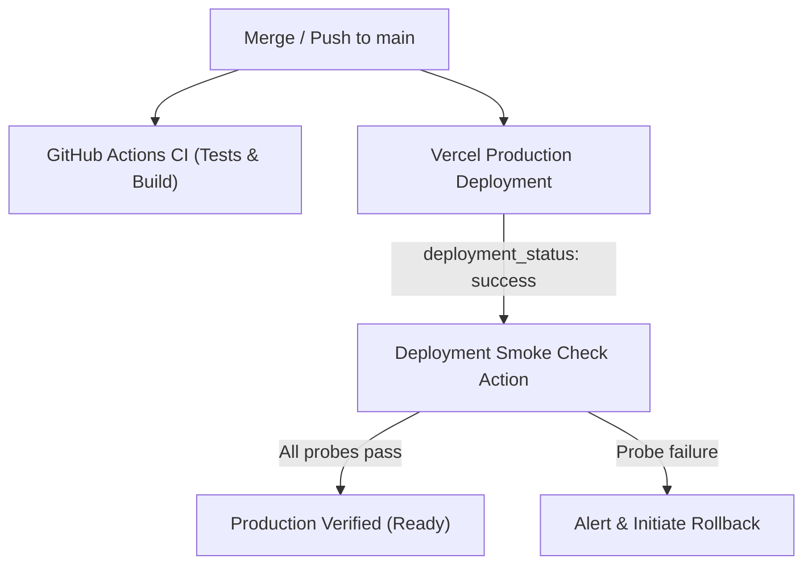

# Deployment and rollback

This runbook covers the production deployment lifecycle, post-deployment smoke verification,
and tiered rollback procedures for BiwengerStats.



---

## Deployment lifecycle and gates

1. **Pre-merge validation:**
   - Every change must pass GitHub Actions CI (`.github/workflows/ci.yml`), which validates formatting, architecture boundaries, ESLint, TypeScript types, schema metadata consistency, Vitest unit tests, and the Next.js production build.
2. **Production deployment:**
   - Merging or pushing to `main` triggers Vercel's automatic production deployment pipeline.
   - Production URL: `https://advanced-euroleague-biwenger-stats.vercel.app` (or custom configured domain).
3. **Post-deploy verification:**
   - Once Vercel signals successful deployment, the smoke check workflow validates live HTTP contracts, SSR hydration, and database connectivity.

---

## Post-deployment smoke check

The post-deploy smoke check runs four targeted probes to guarantee that the live environment is healthy:

| Probe                       | Target Path          | Expected Status    | Validation Criteria                                                                      |
| :-------------------------- | :------------------- | :----------------- | :--------------------------------------------------------------------------------------- |
| **Application & DB Health** | `/api/health`        | `200`              | JSON response confirms `status: 'healthy'` and `database.status: 'connected'`.           |
| **Authentication SSR**      | `/login`             | `200`              | Verifies server-side rendering succeeded and login form markers are present in the HTML. |
| **Public Data Contract**    | `/api/landing-stats` | `200`              | Verifies public JSON response envelope contains `{ success: true }`.                     |
| **Landing Availability**    | `/`                  | `200` or `307/308` | Verifies root route responds without unhandled exceptions or 500 errors.                 |

### Running smoke checks via GitHub Actions

The smoke check runs automatically on production deployments, but can also be triggered on demand:

1. Navigate to **Actions** $\rightarrow$ **Deployment Smoke Check**.
2. Click **Run workflow**.
3. (Optional) Provide a custom preview or staging URL, or leave blank to probe the default production URL.
4. Inspect the step logs for probe latency and status codes.

### Running smoke checks locally via CLI

You can run the smoke runner against any deployed or local environment:

```bash
# Probe production
npm run smoke:deploy

# Probe a specific Vercel preview or staging URL
npm run smoke:deploy https://biwengerstats-next-git-preview.vercel.app

# Probe local dev / preview server
npm run smoke:deploy http://localhost:3000
```

---

## Tiered rollback procedures

If a deployment introduces a critical regression, choose the appropriate rollback tier:

### Tier 1: Instant Vercel Rollback (~10 seconds)

Use when an immediate user-facing outage occurs (e.g. fatal SSR crash, missing client environment variable, broken asset).

- **Via Vercel Web Dashboard:**
  1. Open the project in the [Vercel Dashboard](https://vercel.com).
  2. Navigate to **Deployments**.
  3. Locate the previous known-healthy production deployment.
  4. Click the three dots (`...`) and select **Instant Rollback** (or **Promote to Production**).
  5. Traffic instantly points to the previous build with zero downtime.

- **Via Vercel CLI:**
  ```bash
  vercel rollback
  ```

---

### Tier 2: Clean Git Revert (~2 minutes)

Use for standard application bugs where maintaining an accurate Git audit trail on `main` is desired.

1. Ensure your local `main` is up to date:
   ```bash
   git checkout main && git pull origin main
   ```
2. Revert the offending commit:

   ```bash
   # Revert a regular commit
   git revert <bad-commit-sha>

   # Revert a merge commit (specifying parent 1)
   git revert -m 1 <bad-merge-sha>
   ```

3. Push to `main`:
   ```bash
   git push origin main
   ```
4. Vercel will automatically build and deploy the reverted state. Run `npm run smoke:deploy` to confirm recovery.

---

### Tier 3: Database & Migration Rollback

Use when the faulty deployment introduced database schema migrations or data mutations.

> [!CAUTION]
> Never attempt a blind database rollback without consulting [`docs/operations/database-safety.md`](database-safety.md).

1. Determine whether the migration was purely additive (e.g., `ADD COLUMN IF NOT EXISTS`). If additive, Tier 1 or Tier 2 rollback is usually safe without touching the database.
2. If destructive or state-altering, follow the database safety runbook to restore a point-in-time backup or apply a compensatory migration.

---

## Incident response checklist

- [ ] **1. Identify Failure:** Check the failing smoke probe in GitHub Actions or test output.
- [ ] **2. Check Uptime:** Inspect `/api/health` to determine if the failure is database connection loss or application-level code error.
- [ ] **3. Mitigate Immediately:** If production is broken for users, execute a **Tier 1 Instant Rollback** in Vercel.
- [ ] **4. Diagnose in Worktree:** Create an isolated worktree (`../biwengerstats-next-fix-...`) to reproduce the failure locally.
- [ ] **5. Validate & Re-deploy:** Test the fix thoroughly with `npm run smoke:deploy http://localhost:3000` before merging.
