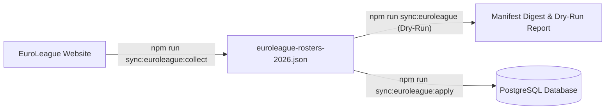

# EuroLeague official website sync

This runbook covers scraping official roster profiles, codes, bio metadata, and studio photoshoot
portraits from the [official EuroLeague website](https://www.euroleaguebasketball.net) and safely
synchronizing them into PostgreSQL.

The tooling lives under [`scripts/euroleague/`](../../scripts/euroleague) and is designed as two
decoupled, independently testable stages:



---

## Architecture and data flow

The pipeline is split into two distinct scripts to prevent mixing web scraping concerns with database transactions:

1. **Collection Stage (`scripts/euroleague/collect.ts`)**:
   - Standalone Playwright scraper running headless.
   - Extracts all 20 club rosters, player profile pages, bio attributes (country, birth date, height, weight), official codes (including exceptions like Sergio Llull `PTGB`), and photoshoot portraits.
   - Normalizes names, strips name suffixes (`Jr.`, `II`, `III`), and parses European dates (`DD/MM/YYYY`).
   - Writes the complete dataset to [`scripts/euroleague/data/euroleague-rosters-2026.json`](../../scripts/euroleague/data/euroleague-rosters-2026.json).

2. **Synchronization Stage (`scripts/euroleague/sync.ts`)**:
   - Standalone database synchronizer with zero browser dependencies.
   - Validates CDN image headers and dimensions using Sharp.
   - Applies 3-tier candidate matching (Exact Code $\rightarrow$ Normalized Name + Team $\rightarrow$ Interactive Terminal Resolution).
   - Generates a dry-run report and SHA-256 digest before writing.
   - Applies updates in an atomic PostgreSQL transaction with a 5-second advisory lock.

---

## Safety guarantees and invariants

The synchronizer follows strict non-destructive rules:

1. **Non-Destructive Bio Enrichments**:
   - `players` table fields (`euroleague_code`, `country`, `birth_date`, `height`, `profile_url`) are populated using `COALESCE(column, EXCLUDED.value)`.
   - Existing non-null fields in the database are **never overwritten**.
   - `players.name` is **never overwritten**.

2. **Silhouette Placeholder Filtering**:
   - When EuroLeague has not published a player's official media-day portrait yet, they display a shared generic gray silhouette placeholder.
   - The synchronizer detects shared placeholder URLs and sets `image_url = null`.
   - This ensures the application falls back to the player's existing Biwenger portrait (`players.img`) instead of displaying a gray shadow.

3. **Protection Against Future API Overwrites**:
   - The routine EuroLeague API sync (`src/lib/sync/pipeline.ts`) runs periodically during the season.
   - Website photoshoot mappings are tagged with `'website_image'` inside `official_player_mappings.raw_payload`.
   - The API sync query uses `CASE WHEN raw_payload ? 'website_image' THEN image_url ELSE EXCLUDED.image_url END`, guaranteeing routine API syncs will never replace official website photoshoot portraits.

4. **Biwenger Image Fallback Preserved**:
   - `players.img` and `teams.img` are **strictly untouched**. They serve as the trusted fallback whenever an official portrait is unavailable.

---

## Commands reference

| Command                           | Purpose                                                                                                                   |
| :-------------------------------- | :------------------------------------------------------------------------------------------------------------------------ |
| `npm run sync:euroleague`         | Execute a dry-run check, validate CDN images, and print the synchronization report. Writes zero database changes.         |
| `npm run sync:euroleague:apply`   | Atomically apply all bio enrichments and official photoshoot mappings to PostgreSQL.                                      |
| `npm run sync:euroleague:collect` | Run the Playwright scraper to refresh `scripts/euroleague/data/euroleague-rosters-2026.json` from the EuroLeague website. |

---

## Operational tutorial

### Step 1: Preview changes (dry-run)

Always run a dry-run first to inspect candidate matches and field enrichments:

```bash
npm run sync:euroleague
```

The report details:

- **Roster Assets Ready**: Number of players and teams matched.
- **Real Photoshoot Portraits**: Verified high-resolution CDN portraits.
- **Biwenger Photo Fallbacks**: Players with generic silhouettes where Biwenger images are preserved.
- **Durable Bio Enrichments**: Count of `NULL` fields in `players` that will be filled.
- **Unresolved / Non-Roster**: Players present in Biwenger that do not appear on EuroLeague's active roster (e.g. transferred players or youth players).

### Step 2: Apply to database

Once the dry-run report is verified, commit the changes to PostgreSQL:

```bash
npm run sync:euroleague:apply
```

This runs an atomic transaction that:

1. Enriches missing bio fields on `players`.
2. Inserts or updates season records in `official_player_mappings` with status `'matched'` and confidence `1`.
3. Attaches provenance metadata (`website_profile` and `website_image`) to `raw_payload`.

### Step 3: Re-running when new portraits are uploaded

During the season, EuroLeague gradually uploads missing photoshoot portraits for new transfers and youth players.

To update the database with new portraits:

1. Re-scrape the latest rosters:
   ```bash
   npm run sync:euroleague:collect
   ```
2. Apply the newly available portraits:
   ```bash
   npm run sync:euroleague:apply
   ```

Because `official_player_mappings` updates use:

```sql
image_url = CASE WHEN EXCLUDED.image_url IS NOT NULL THEN EXCLUDED.image_url ELSE image_url END
```

Any player whose portrait was previously `null` (silhouette) will be seamlessly upgraded to their newly uploaded high-res photoshoot photo without modifying any other data.

---

## Interactive candidate resolution

If an ambiguous name match occurs during preview, you can run the interactive resolver:

```bash
npx tsx scripts/euroleague/sync.ts --dry-run --interactive
```

The interactive prompt displays the player's name, team, and a numbered list of candidates from the database:

```text
❓ Multiple candidates found for 'DAVID DEJULIUS' (Besiktas Istanbul):
  [1] De julius David (ID: 25630, Team: Besiktas Istanbul)
  [s] Skip this player
Enter choice [1-1, s]: 1
✅ Saved override for BES:P009025 -> Player ID 25630
```

Selected matches are automatically persisted to [`scripts/euroleague/overrides.json`](../../scripts/euroleague/overrides.json) so future runs resolve them deterministically without user intervention.

---

## Running via GitHub Actions (UI)

To synchronize or scrape without using a local terminal or configuring local credentials:

1. Navigate to your repository on GitHub.
2. Click the **Actions** tab.
3. Select **EuroLeague Website Sync** from the left sidebar.
4. Click **Run workflow**, select the execution mode from the dropdown, and click the green button:
   - **`apply` (Default)**: Uses the committed roster collection to enrich PostgreSQL in ~5 seconds.
   - **`dry-run`**: Validates CDN portraits and logs the full report without writing changes.
   - **`collect-and-apply`**: Launches headless Chromium on Ubuntu, scrapes the latest EuroLeague rosters, applies new portraits to PostgreSQL, and commits the updated JSON back to the repository.
