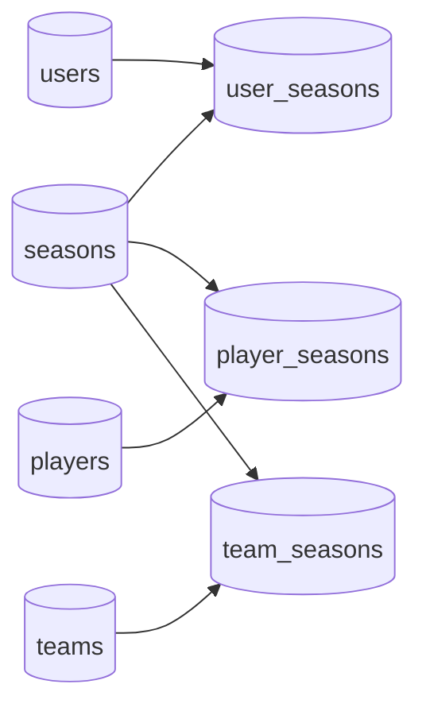

# Data model reference

[`src/lib/db/schema.ts`](../../src/lib/db/schema.ts) is the application schema source of truth. This
page groups current tables by responsibility; inspect the schema before relying on exact column
names, constraints, or indexes.

## Identity and season scope

The model distinguishes durable identities from state that can change between seasons:

- `seasons` — lifecycle state and provider binding for one fantasy season.
- `users`, `teams`, `players` — durable cross-season identities synchronized from providers.
- `user_seasons` — season-specific manager identity/state, keyed by `(season_id, user_id)`.
- `team_seasons`, `player_seasons` — season-specific team/player attributes, relationships, and
  current state.
- `player_mappings` — historical global EuroLeague links retained as a read-only mapping fallback.
- `official_team_mappings`, `official_player_mappings` — season-scoped official identity links,
  mapping provenance, and review state.

Season-varying attributes must not be reintroduced on the global identity tables. The architectural
rationale is recorded in [ADR-0005](../decisions/0005-season-scoped-domain-model.md).

## Competition and performance

- `matches` — canonical per-season game schedule, participants, status, result, venue, and
  official-game link.
- `user_rounds` — manager points and placement by round and season.
- `lineups` — historical selected players, roles, and fantasy results.
- `player_round_stats` — season/round player performance, participation provenance, and
  fantasy/official metrics.
- `official_play_by_play`, `official_shots` — granular official event and shot data keyed to the
  persisted game.
- `official_team_standings` — official team standings snapshots by season/round.
- `initial_squads` — starting squad snapshots used by draft and historical analytics.

Game-level official staging tables are not part of the current schema. Official schedule/game state
is consolidated into `matches`, and materialized player performance is consolidated into
`player_round_stats`.

## Market and finance

- `fichajes` — completed transfer history.
- `transfer_bids` — auction bid history.
- `market_values` — durable player price history.
- `market_listings` — current/listing snapshots captured by the rollover-aware sync step.
- `finances` — manager financial events.

`player_seasons.price` is the current season price cache, not the price-history source. See
[database safety](../operations/database-safety.md) for auditing and repair.

## Tournaments and predictions

- `tournaments`, `tournament_phases` — competition identity and phase structure.
- `tournament_fixtures`, `tournament_standings` — tournament fixtures and rankings.
- `porras` — synchronized Biwenger prediction-pool records.
- `playoff_predictions`, `playoff_results`, `user_playoff_media` — custom playoff feature state.

## Interactive features, credentials, and metadata

- `hoopgrid_challenges`, `hoopgrid_guesses` — daily grid definition, guesses, and rarity source data.
- `assistant_conversations`, `assistant_messages` — user-owned assistant history.
- `user_biwenger_credentials` — encrypted personal Biwenger credential envelopes and key metadata.
- `sync_meta` — synchronization metadata used by ingestion tooling.

## Write ownership

Normal application writes use focused modules under
[`src/lib/db/mutations`](../../src/lib/db/mutations) or a feature-owned repository/query boundary.
The sync pipeline owns provider-derived season facts. Account, assistant, market action, and
Hoopgrid flows own their user-triggered records. All write paths must retain season and user
isolation appropriate to the table.
